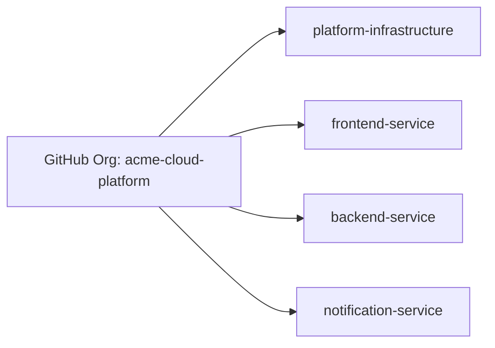
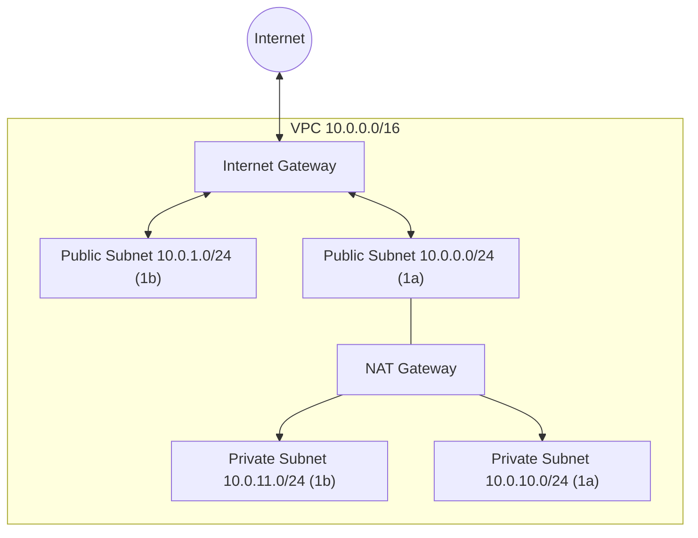
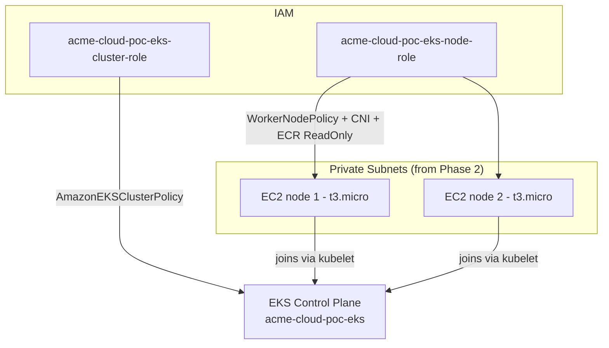
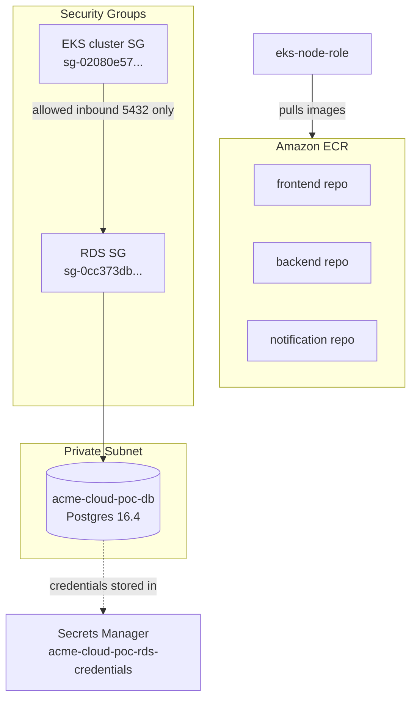
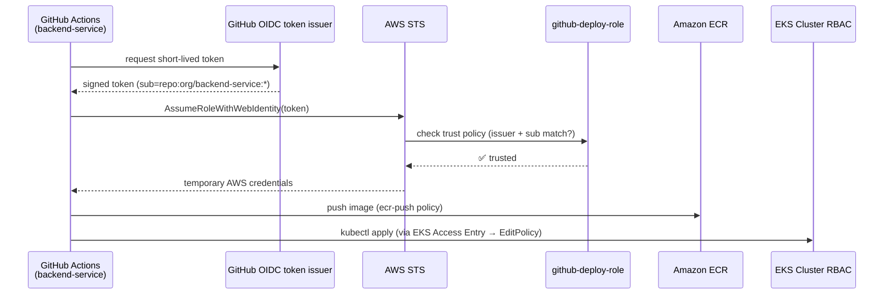
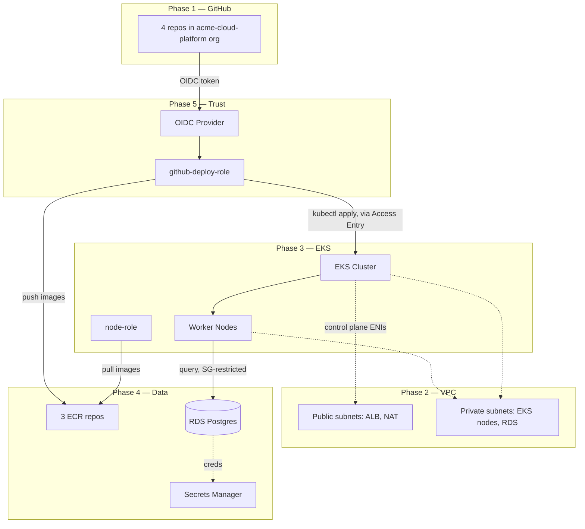

# Architecture & Connections — Phases 1 through 5

This is the "how does everything actually connect" reference. Every phase
below lists: what got created, where it lives, and exactly how it talks to
the things around it — including real IAM roles, ARNs, and security group
relationships from our actual build (not generic placeholders).

Diagrams use Mermaid — render natively on GitHub.

---

## Phase 1 — GitHub Org + Repos

**What exists:**
- Org: `acme-cloud-platform`
- Repos: `platform-infrastructure`, `frontend-service`, `backend-service`, `notification-service`

**Connection to later phases:** every repo will eventually hold a `.github/workflows/deploy.yml` that assumes the IAM role built in Phase 5. No AWS connection exists yet at this phase — purely source control.



---

## Phase 2 — VPC / Networking

**What exists:**
| Resource | Value |
|---|---|
| VPC | `vpc-0d0f8e9094111d711` (`10.0.0.0/16`) |
| Public subnets | `10.0.0.0/24` (us-east-1a), `10.0.1.0/24` (us-east-1b) |
| Private subnets | `10.0.10.0/24` (us-east-1a), `10.0.11.0/24` (us-east-1b) |
| Internet Gateway | `acme-cloud-poc-igw` |
| NAT Gateway | `acme-cloud-poc-nat` (single NAT, in public subnet) |
| Route tables | `acme-cloud-poc-public-rt`, `acme-cloud-poc-private-rt` |

**How it connects:**
- Public subnets route `0.0.0.0/0` → **Internet Gateway** directly (inbound/outbound internet)
- Private subnets route `0.0.0.0/0` → **NAT Gateway** (outbound only — private subnet resources can reach the internet to pull images/updates, but nothing from the internet can initiate a connection to them)
- Public subnets are tagged `kubernetes.io/role/elb = 1` — tells the AWS Load Balancer Controller (Phase 6) "put internet-facing ALBs here"
- Private subnets are tagged `kubernetes.io/role/internal-elb = 1` — tells it "put internal ALBs here" and this is also where EKS nodes + RDS live



---

## Phase 3 — EKS Cluster + Node Group

**What exists:**
| Resource | Value |
|---|---|
| Cluster | `acme-cloud-poc-eks` |
| Cluster endpoint | `https://1CE30413C41DA517ADB1C61C126172E5.gr7.us-east-1.eks.amazonaws.com` |
| Cluster security group | `sg-02080e5747d7198f9` |
| Cluster IAM role | `acme-cloud-poc-eks-cluster-role` (trusts `eks.amazonaws.com`) |
| Node IAM role | `acme-cloud-poc-eks-node-role` — `arn:aws:iam::338449997393:role/acme-cloud-poc-eks-node-role` (trusts `ec2.amazonaws.com`) |
| Node group | `acme-cloud-poc-nodes` — 2× `t3.micro`, private subnets only |
| Auth mode | `API_AND_CONFIG_MAP` (needed for Phase 5's access entries) |

**How it connects:**
- Cluster control plane ENIs sit across **all 4 subnets** (public + private) from Phase 2
- Worker nodes (the actual EC2 instances) sit **only in private subnets** — no public IP, no direct internet exposure, all outbound traffic goes through the NAT Gateway
- `acme-cloud-poc-eks-node-role` has 3 AWS-managed policies attached: `AmazonEKSWorkerNodePolicy` (talk to control plane), `AmazonEC2ContainerRegistryReadOnly` (pull images from ECR — connects to Phase 4), `AmazonEKS_CNI_Policy` (pod networking)
- `acme-cloud-poc-eks-cluster-role` has `AmazonEKSClusterPolicy` attached — lets AWS manage the control plane on your behalf



---

## Phase 4 — ECR Repos + RDS

**What exists — ECR:**
| Repo | URL |
|---|---|
| frontend | `338449997393.dkr.ecr.us-east-1.amazonaws.com/acme-cloud-poc-frontend` |
| backend | `338449997393.dkr.ecr.us-east-1.amazonaws.com/acme-cloud-poc-backend` |
| notification | `338449997393.dkr.ecr.us-east-1.amazonaws.com/acme-cloud-poc-notification` |

**What exists — RDS:**
| Resource | Value |
|---|---|
| DB instance | `acme-cloud-poc-db` (Postgres 16.4, `db.t3.micro`) |
| Endpoint | `acme-cloud-poc-db.c8vqsikioi3n.us-east-1.rds.amazonaws.com` |
| Subnet group | private subnets only (from Phase 2) |
| Security group | `sg-0cc373dbdf0493486` |
| Secrets Manager secret | `arn:aws:secretsmanager:us-east-1:338449997393:secret:acme-cloud-poc-rds-credentials-GLxxD4` |
| Publicly accessible | `false` |

**How it connects:**
- RDS security group `sg-0cc373dbdf0493486` allows inbound **only** from the **EKS cluster security group** (`sg-02080e5747d7198f9`, from Phase 3) on port 5432 — nothing else in the account, and nothing on the internet, can reach the database
- DB credentials (username, password, host, port) are stored as JSON in Secrets Manager — this secret ARN is what **External Secrets Operator** (Phase 7, not built yet) will sync into a Kubernetes Secret
- ECR repos have zero network dependency — they're pulled into the picture only when the node IAM role (`acme-cloud-poc-eks-node-role`, Phase 3) uses its `AmazonEC2ContainerRegistryReadOnly` permission to pull images at pod-start time



---

## Phase 5 — IAM OIDC Provider for GitHub Actions

**What exists:**
| Resource | Value |
|---|---|
| OIDC provider | `arn:aws:iam::338449997393:oidc-provider/token.actions.githubusercontent.com` |
| Deploy role | `acme-cloud-poc-github-deploy-role` — `arn:aws:iam::338449997393:role/acme-cloud-poc-github-deploy-role` |
| Trusted repos | `frontend-service`, `backend-service`, `notification-service`, `platform-infrastructure` (org: `acme-cloud-platform`) |
| EKS access entry | maps the deploy role to `AmazonEKSEditPolicy` (cluster-scoped) |

**How it connects — this is the important one, the full trust chain:**

1. A GitHub Actions workflow runs in, say, `backend-service`
2. GitHub mints a short-lived OIDC token, signed, claiming `repo:acme-cloud-platform/backend-service:*`
3. The workflow calls AWS STS `AssumeRoleWithWebIdentity`, presenting that token
4. AWS checks: does this token's issuer match `oidc-provider/token.actions.githubusercontent.com`? ✅ (the OIDC provider resource)
5. AWS checks: does the `sub` claim in the token match one of the `StringLike` conditions on `acme-cloud-poc-github-deploy-role`'s trust policy? ✅ (repo is in the allowed list)
6. AWS issues **temporary credentials**, scoped to this role, valid only for the workflow run's duration — no static key was ever stored anywhere
7. Those temporary credentials carry two attached inline policies: `ecr-push` (can push images to any of the 3 ECR repos from Phase 4) and `eks-describe` (can call `DescribeCluster`, needed for `aws eks update-kubeconfig`)
8. Separately, the **EKS Access Entry** maps this same role ARN to `AmazonEKSEditPolicy` inside the cluster's own RBAC — this is what actually lets `kubectl apply` succeed once authenticated, since IAM permissions alone don't grant Kubernetes-level permissions



---

## Full picture so far — everything connected



---

## Quick-reference: every ARN / ID we have so far

```
VPC ID:                    vpc-0d0f8e9094111d711
EKS cluster:                acme-cloud-poc-eks
EKS cluster SG:              sg-02080e5747d7198f9
EKS node role:                arn:aws:iam::338449997393:role/acme-cloud-poc-eks-node-role
RDS endpoint:                  acme-cloud-poc-db.c8vqsikioi3n.us-east-1.rds.amazonaws.com
RDS security group:              sg-0cc373dbdf0493486
RDS secret:                        arn:aws:secretsmanager:us-east-1:338449997393:secret:acme-cloud-poc-rds-credentials-GLxxD4
OIDC provider:                       arn:aws:iam::338449997393:oidc-provider/token.actions.githubusercontent.com
GitHub deploy role:                    arn:aws:iam::338449997393:role/acme-cloud-poc-github-deploy-role
ECR frontend:      338449997393.dkr.ecr.us-east-1.amazonaws.com/acme-cloud-poc-frontend
ECR backend:        338449997393.dkr.ecr.us-east-1.amazonaws.com/acme-cloud-poc-backend
ECR notification:     338449997393.dkr.ecr.us-east-1.amazonaws.com/acme-cloud-poc-notification
```

*(Will append Phases 6-11 here as we build them.)*