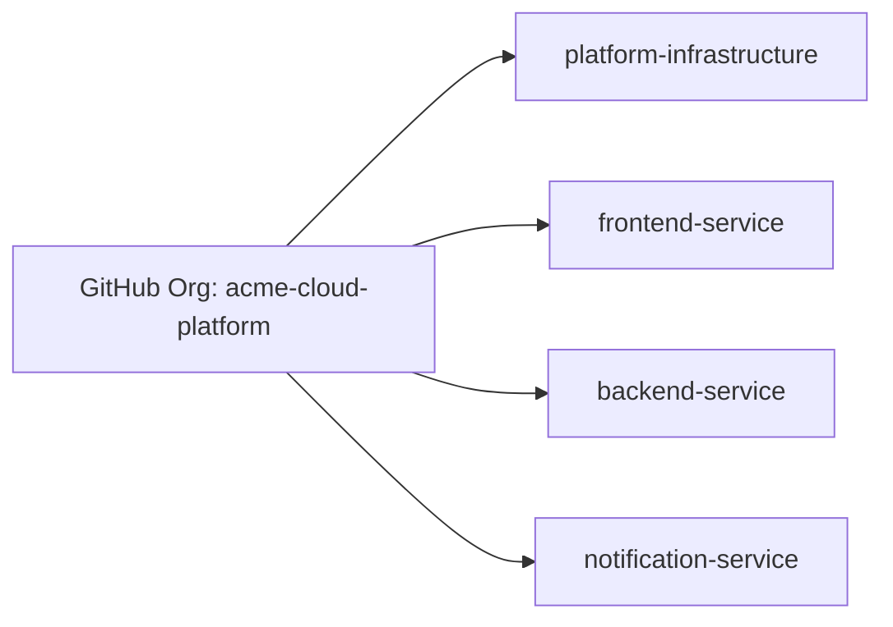
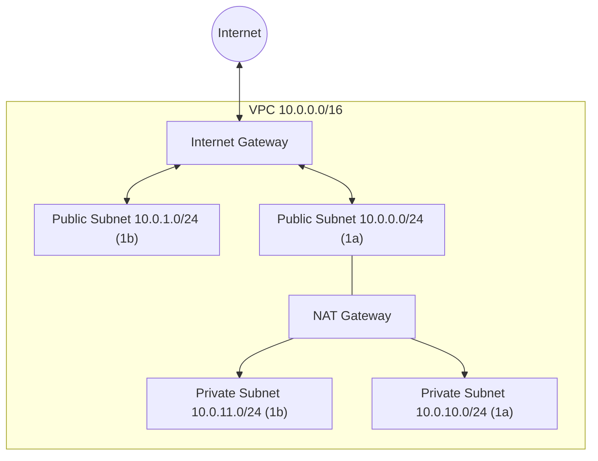
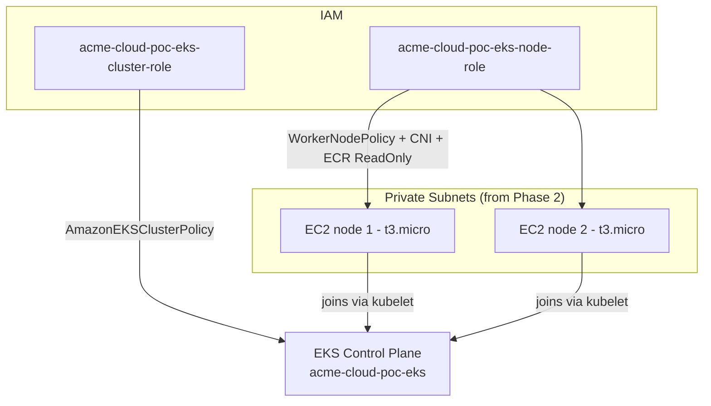
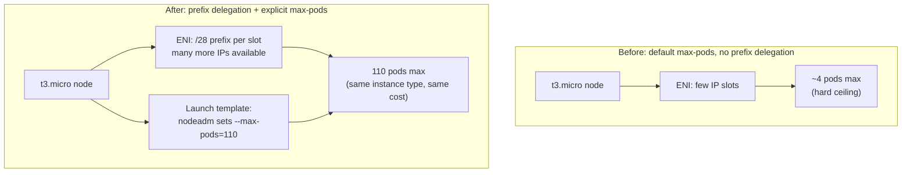
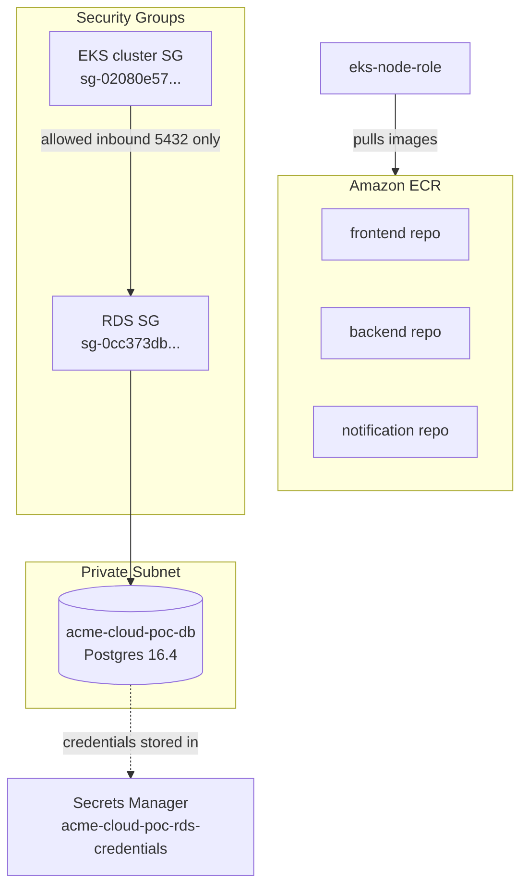
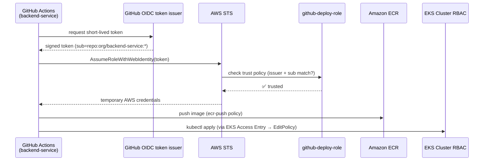
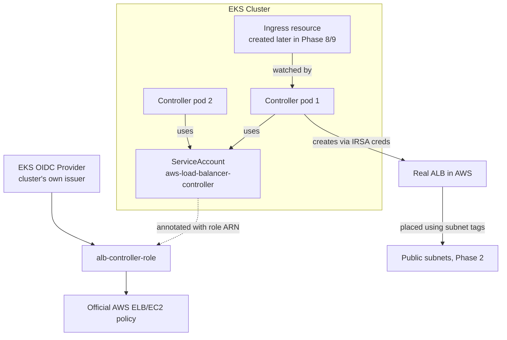
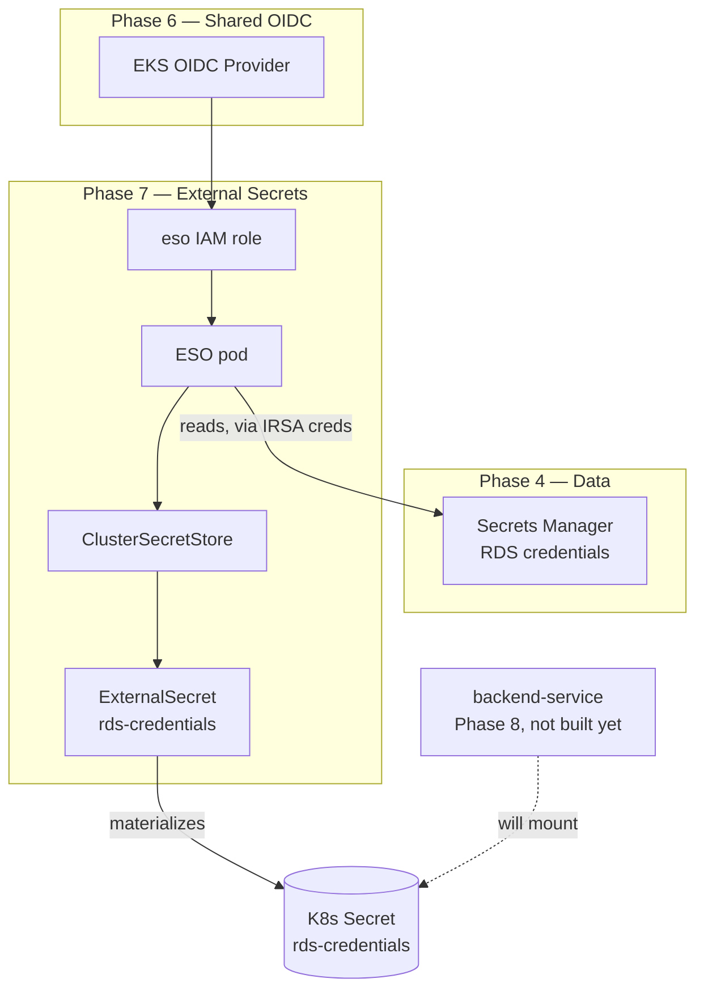
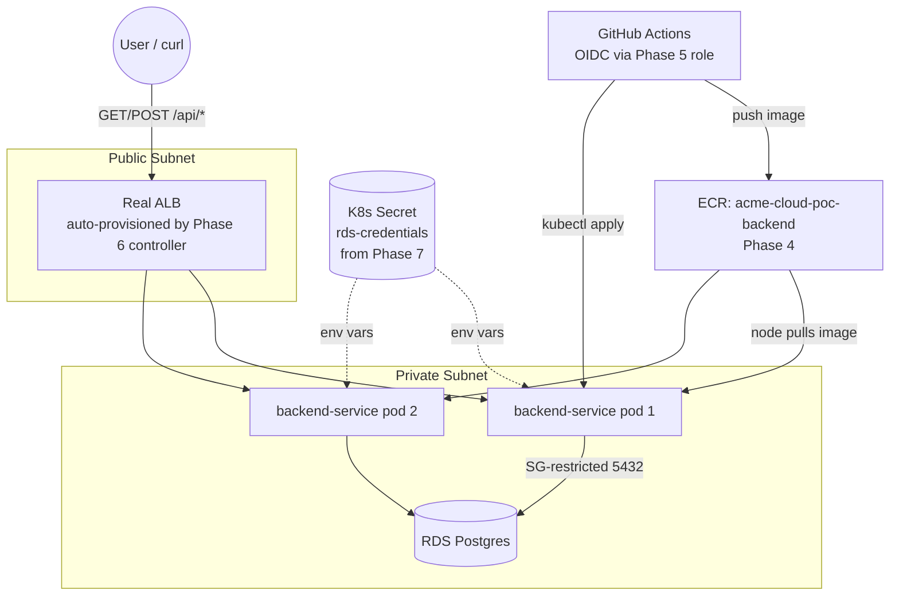
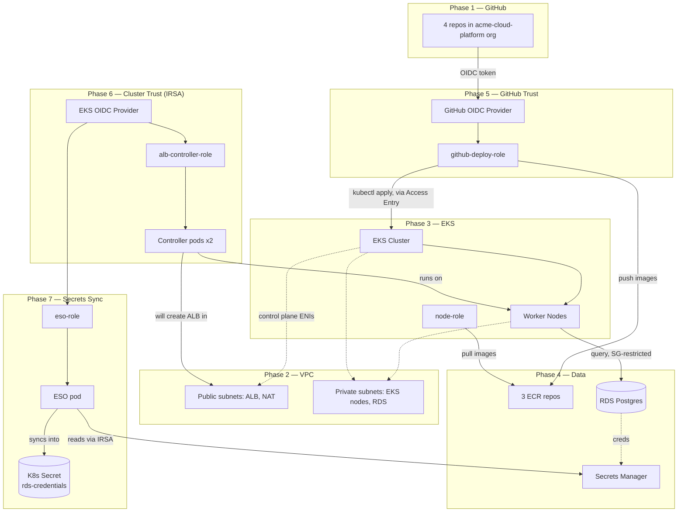

# platform-infrastructure

Central platform repo for the **Acme Cloud** microservices project — Terraform, CI/CD, and cluster config for all application services.

## Documentation — start here

We have 3 docs now, each answering a different question. Read in this order the first time:

| Doc | Answers | Read when |
|---|---|---|
| **This file (`README.md`)** | What is this project, what's the architecture, what phase are we on, how does everything connect | First, and any time you need the big picture |
| **[`Must-Manual-setup.md`](Must-Manual-setup.md)** | How do I set up my machine from zero? (AWS account, IAM user, CLI, Terraform install) | Once, before the very first `terraform init` |
| **[`RUNBOOK.md`](RUNBOOK.md)** | What exact command do I run right now, for deploy/verify/destroy? | Every session — this is your day-to-day cheat sheet |
| **[`POC.md`](POC.md)** | Why did we design it this way? (ALB vs nginx, no API Gateway, network layout, per-service breakdown) | When you need the reasoning behind a decision — e.g. for an interview |

---

## Organization repos

| Repo | Purpose | Status |
|---|---|---|
| [`platform-infrastructure`](.) | Terraform, Helm, reusable CI/CD workflow | 🚧 in progress |
| `frontend-service` | React app | ⬜ not started |
| `backend-service` | FastAPI app | ⬜ not started |
| `notification-service` | Worker service | ⬜ not started |

---

## Architecture at a glance

**Network**: VPC → 2 public subnets (ALB, NAT Gateway) + 2 private subnets (EKS nodes, RDS)
**Ingress**: AWS Load Balancer Controller provisions ALB directly from K8s Ingress resources — no nginx
**Compute**: EKS + managed node group, autoscaled
**Database**: RDS Postgres, private subnet only, no public access
**Secrets**: Secrets Manager + External Secrets Operator → K8s Secrets
**CI/CD auth**: GitHub OIDC → IAM role, zero static AWS keys anywhere
**Registry**: 3 ECR repos (frontend, backend, notification)
**Observability**: CloudWatch + Prometheus/Grafana
**No API Gateway** — no external API product, ALB is sufficient

Each service repo owns: source code, Dockerfile, Helm values, and a workflow file that calls this repo's reusable workflow. This repo owns: Terraform, base Helm charts, the reusable workflow. Adding a new microservice never requires changing this repo.

---

## Phase tracker

Update the checkbox as each phase completes. This is our single source of truth for where the build stands. Full detail on what each completed phase built and how it connects lives right below this tracker.

- [✅] **Phase 1 — GitHub org + 4 repos created**
- [✅] **Phase 2 — VPC/networking Terraform** (VPC, public/private subnets, IGW, NAT Gateway)
- [✅] **Phase 3 — EKS cluster + managed node group**
- [✅] **Phase 4 — ECR repos + RDS (private subnet)**
- [✅] **Phase 5 — IAM OIDC provider for GitHub Actions (no static keys)**
- [✅] **Phase 6 — AWS Load Balancer Controller (Ingress → real ALB)**
- [✅] **Phase 7 — External Secrets Operator + Secrets Manager wiring**
- [✅] **Phase 8 — `backend-service`: Dockerfile, K8s manifests, CI/CD pipeline, deployed** *(current)*
- [ ] **Phase 9 — `frontend-service`: Dockerfile, K8s manifests, CI/CD pipeline, deployed**
- [ ] **Phase 10 — `notification-service`: Dockerfile, K8s manifests, CI/CD pipeline, deployed (zero infra changes)**
- [ ] **Phase 11 — Prometheus/Grafana + Cluster Autoscaler, verified under load**

---

## Architecture & connections — what each phase built, and how it connects

Diagrams use Mermaid — render natively on GitHub.

### Phase 1 — GitHub Org + Repos

**What exists:**
- Org: `acme-cloud-platform`
- Repos: `platform-infrastructure`, `frontend-service`, `backend-service`, `notification-service`

**Connection to later phases:** every repo will eventually hold a `.github/workflows/deploy.yml` that assumes the IAM role built in Phase 5. No AWS connection exists yet at this phase — purely source control.



### Phase 2 — VPC / Networking

**What exists:**
| Resource | Value |
|---|---|
| VPC | `vpc-0d0f8e9094111d711` (`10.0.0.0/16`) |
| Public subnets | `10.0.0.0/24` (us-east-1a), `10.0.1.0/24` (us-east-1b) |
| Private subnets | `10.0.10.0/24` (us-east-1a), `10.0.11.0/24` (us-east-1b) |
| Internet Gateway | `acme-cloud-poc-igw` |
| NAT Gateway | `acme-cloud-poc-nat` (single NAT, in public subnet) |
| Route tables | `acme-cloud-poc-public-rt`, `acme-cloud-poc-private-rt` |

**How it connects:**
- Public subnets route `0.0.0.0/0` → **Internet Gateway** directly (inbound/outbound internet)
- Private subnets route `0.0.0.0/0` → **NAT Gateway** (outbound only — private subnet resources can reach the internet to pull images/updates, but nothing from the internet can initiate a connection to them)
- Public subnets are tagged `kubernetes.io/role/elb = 1` — tells the AWS Load Balancer Controller (Phase 6) "put internet-facing ALBs here"
- Private subnets are tagged `kubernetes.io/role/internal-elb = 1` — tells it "put internal ALBs here" and this is also where EKS nodes + RDS live



### Phase 3 — EKS Cluster + Node Group

**What exists:**
| Resource | Value |
|---|---|
| Cluster | `acme-cloud-poc-eks` |
| Cluster endpoint | `https://1CE30413C41DA517ADB1C61C126172E5.gr7.us-east-1.eks.amazonaws.com` |
| Cluster security group | `sg-02080e5747d7198f9` |
| Cluster IAM role | `acme-cloud-poc-eks-cluster-role` (trusts `eks.amazonaws.com`) |
| Node IAM role | `acme-cloud-poc-eks-node-role` — `arn:aws:iam::338449997393:role/acme-cloud-poc-eks-node-role` (trusts `ec2.amazonaws.com`) |
| Node group | `acme-cloud-poc-nodes` — 3× `t3.micro`, private subnets only, `--max-pods=110` per node |
| Auth mode | `API_AND_CONFIG_MAP` (needed for Phase 5's access entries) |
| Launch template | `acme-cloud-poc-nodes-*` — custom AL2023 `nodeadm` bootstrap, overrides max-pods |
| VPC CNI addon | `ENABLE_PREFIX_DELEGATION=true`, `WARM_PREFIX_TARGET=1` |

**How it connects:**
- Cluster control plane ENIs sit across **all 4 subnets** (public + private) from Phase 2
- Worker nodes (the actual EC2 instances) sit **only in private subnets** — no public IP, no direct internet exposure, all outbound traffic goes through the NAT Gateway
- `acme-cloud-poc-eks-node-role` has 3 AWS-managed policies attached: `AmazonEKSWorkerNodePolicy` (talk to control plane), `AmazonEC2ContainerRegistryReadOnly` (pull images from ECR — connects to Phase 4), `AmazonEKS_CNI_Policy` (pod networking)
- `acme-cloud-poc-eks-cluster-role` has `AmazonEKSClusterPolicy` attached — lets AWS manage the control plane on your behalf



#### Pod density: prefix delegation + max-pods (why we needed both)

Hit a real scheduling wall building Phase 7 (External Secrets Operator): pods stuck `Pending` with `0/2 nodes available: Too many pods`. Root cause and full production reasoning below — this became a genuine platform-engineering problem, not just a config tweak.

**Why `t3.micro` has a pod ceiling at all**

Kubernetes doesn't limit pods-per-node by CPU/memory alone — on AWS, the kubelet also enforces `--max-pods`, a hard ceiling based on how many IP addresses the instance's Elastic Network Interfaces (ENIs) can hand out. Small instance types like `t3.micro` have very few ENI "slots," so by default they can only host a handful of pods (well under 10) — regardless of how much CPU/memory is actually free. This is a **networking limit, not a resource limit**, which is why `kubectl describe nodes` showed low CPU/memory usage even while pods failed to schedule.

**Fix 1 — VPC CNI Prefix Delegation** (`ENABLE_PREFIX_DELEGATION=true`, `WARM_PREFIX_TARGET=1`)
Instead of the CNI handing out pod IPs one-per-ENI-slot, prefix delegation lets it hand out entire `/28` IP prefixes per ENI slot — dramatically increasing how many IPs (and therefore pods) a single small instance can support, **at no extra EC2 cost**. This is standard practice on **every EKS cluster in production, regardless of node size** — not a POC-only workaround.

**Fix 2 — Explicit `--max-pods=110` via custom launch template**
Prefix delegation alone wasn't enough: the kubelet's `--max-pods` value is calculated once, at node boot, from a static AWS lookup table keyed on instance type — it doesn't automatically know prefix delegation happened. So even after enabling it, existing (and freshly-booted default) nodes kept their old low ceiling. The real fix required a **custom `aws_launch_template`** using the modern AL2023 `nodeadm` bootstrap format, explicitly setting `kubelet.flags: ["--max-pods=110"]` in the NodeConfig. This forces a node group replacement (~15-20 min) since AMI/bootstrap config changed — expected, not an error.

**Fix 3 — 3 nodes instead of 2**
Bumped `node_desired_size` 2 → 3 in the same change, so there's real headroom for controller pods (ALB Controller, ESO, CoreDNS, kube-proxy, aws-node) plus future application pods (Phase 8-10), without living right at the edge of the ceiling even with the higher max-pods value.



**Production framing — why this matters beyond just "fixing an error":**
Prefix delegation is baseline best practice in real EKS clusters regardless of instance size — AWS's own EKS Best Practices Guide recommends it universally, and newer EKS clusters ship with it on by default. What is **not** standard production practice is running `t3.micro` at all — that instance size only exists in this build because of the AWS account's new-account Free Tier restriction (see Phase 3's resource table history / RUNBOOK troubleshooting). A real production cluster would:
- Size nodes for actual workload CPU/memory requirements (e.g. `m5.large` or bigger), not forced into a tiny instance by an account restriction
- Still enable prefix delegation regardless of that sizing, purely for IP efficiency
- Use **Cluster Autoscaler** (Phase 11 on our roadmap) to add/remove nodes automatically based on real scheduling pressure, instead of a fixed `desired_size` — so capacity grows and shrinks with actual traffic rather than being manually tuned

### Phase 4 — ECR Repos + RDS


**What exists — ECR:**
| Repo | URL |
|---|---|
| frontend | `338449997393.dkr.ecr.us-east-1.amazonaws.com/acme-cloud-poc-frontend` |
| backend | `338449997393.dkr.ecr.us-east-1.amazonaws.com/acme-cloud-poc-backend` |
| notification | `338449997393.dkr.ecr.us-east-1.amazonaws.com/acme-cloud-poc-notification` |

**What exists — RDS:**
| Resource | Value |
|---|---|
| DB instance | `acme-cloud-poc-db` (Postgres 16.4, `db.t3.micro`) |
| Endpoint | `acme-cloud-poc-db.c8vqsikioi3n.us-east-1.rds.amazonaws.com` |
| Subnet group | private subnets only (from Phase 2) |
| Security group | `sg-0cc373dbdf0493486` |
| Secrets Manager secret | `arn:aws:secretsmanager:us-east-1:338449997393:secret:acme-cloud-poc-rds-credentials-GLxxD4` |
| Publicly accessible | `false` |

**How it connects:**
- RDS security group `sg-0cc373dbdf0493486` allows inbound **only** from the **EKS cluster security group** (`sg-02080e5747d7198f9`, from Phase 3) on port 5432 — nothing else in the account, and nothing on the internet, can reach the database
- DB credentials (username, password, host, port) are stored as JSON in Secrets Manager — this secret ARN is what **External Secrets Operator** (Phase 7, not built yet) will sync into a Kubernetes Secret
- ECR repos have zero network dependency — they're pulled into the picture only when the node IAM role (`acme-cloud-poc-eks-node-role`, Phase 3) uses its `AmazonEC2ContainerRegistryReadOnly` permission to pull images at pod-start time



### Phase 5 — IAM OIDC Provider for GitHub Actions

**What exists:**
| Resource | Value |
|---|---|
| OIDC provider | `arn:aws:iam::338449997393:oidc-provider/token.actions.githubusercontent.com` |
| Deploy role | `acme-cloud-poc-github-deploy-role` — `arn:aws:iam::338449997393:role/acme-cloud-poc-github-deploy-role` |
| Trusted repos | `frontend-service`, `backend-service`, `notification-service`, `platform-infrastructure` (org: `acme-cloud-platform`) |
| EKS access entry | maps the deploy role to `AmazonEKSEditPolicy` (cluster-scoped) |

**How it connects — the full trust chain:**

1. A GitHub Actions workflow runs in, say, `backend-service`
2. GitHub mints a short-lived OIDC token, signed, claiming `repo:acme-cloud-platform/backend-service:*`
3. The workflow calls AWS STS `AssumeRoleWithWebIdentity`, presenting that token
4. AWS checks: does this token's issuer match `oidc-provider/token.actions.githubusercontent.com`? ✅ (the OIDC provider resource)
5. AWS checks: does the `sub` claim in the token match one of the `StringLike` conditions on `acme-cloud-poc-github-deploy-role`'s trust policy? ✅ (repo is in the allowed list)
6. AWS issues **temporary credentials**, scoped to this role, valid only for the workflow run's duration — no static key was ever stored anywhere
7. Those temporary credentials carry two attached inline policies: `ecr-push` (can push images to any of the 3 ECR repos from Phase 4) and `eks-describe` (can call `DescribeCluster`, needed for `aws eks update-kubeconfig`)
8. Separately, the **EKS Access Entry** maps this same role ARN to `AmazonEKSEditPolicy` inside the cluster's own RBAC — this is what actually lets `kubectl apply` succeed once authenticated, since IAM permissions alone don't grant Kubernetes-level permissions



### Phase 6 — AWS Load Balancer Controller

**What exists:**
| Resource | Value |
|---|---|
| EKS OIDC provider (IRSA) | `arn:aws:iam::338449997393:oidc-provider/oidc.eks.us-east-1.amazonaws.com/id/1CE30413C41DA517ADB1C61C126172E5` |
| Controller IAM role | `acme-cloud-poc-alb-controller-role` — `arn:aws:iam::338449997393:role/acme-cloud-poc-alb-controller-role` |
| Controller IAM policy | official AWS-published policy — full ELB/EC2 permissions to create/manage ALBs, target groups, listeners, security groups |
| Kubernetes ServiceAccount | `aws-load-balancer-controller` in `kube-system`, annotated with the IAM role ARN |
| Helm release | `aws-load-balancer-controller` chart v1.8.1, 2 replicas, both `Running` |

**How it connects — a different kind of OIDC than Phase 5:**

Phase 5's OIDC lets something **outside** AWS (GitHub Actions) assume a role. Phase 6 uses a different mechanism called **IRSA** (IAM Roles for Service Accounts) — it lets a **pod running inside EKS** assume a role, using the cluster's own built-in OIDC issuer (`oidc.eks.us-east-1.amazonaws.com/id/...`), which is separate from GitHub's OIDC issuer.

The trust is entirely carried by one annotation on the Kubernetes ServiceAccount:
```
eks.amazonaws.com/role-arn: arn:aws:iam::338449997393:role/acme-cloud-poc-alb-controller-role
```
When the controller pod starts using that ServiceAccount, EKS automatically injects temporary AWS credentials scoped to that role — no secret, no key, ever stored in the cluster.

Once running, the controller watches the Kubernetes API for `Ingress` resources. When `backend-service`/`frontend-service` (Phase 8/9) create one, the controller reads the subnet tags from Phase 2 (`kubernetes.io/role/elb` for public, `kubernetes.io/role/internal-elb` for private) to decide where to place the ALB, then calls the AWS ELB API directly using its IRSA credentials to actually create it.




### Phase 7 — External Secrets Operator + Secrets Manager Wiring

**What exists:**
| Resource | Value |
|---|---|
| ESO IAM role | `acme-cloud-poc-external-secrets-role` — `arn:aws:iam::338449997393:role/acme-cloud-poc-external-secrets-role` |
| ESO namespace | `external-secrets` |
| ClusterSecretStore | `aws-secretsmanager` — `Ready: True` |
| ExternalSecret | `rds-credentials` (namespace `default`) — `Status: SecretSynced` |
| Synced K8s Secret | `rds-credentials` — 5 keys: username, password, dbname, host, port |

**How it connects:**
- Reuses the **same EKS OIDC provider** from Phase 6 (an AWS account only gets one OIDC provider per issuer URL) — read via remote state instead of recreated
- ESO's IAM role is scoped tightly: read-only, and only on the **one specific RDS secret ARN** from Phase 4, nothing else in Secrets Manager
- Used `ClusterSecretStore` instead of namespaced `SecretStore` — the ESO ServiceAccount lives in the `external-secrets` namespace, but the synced Secret needs to land in `default` (where `backend-service` will run); namespaced `SecretStore` only allows same-namespace ServiceAccount references, `ClusterSecretStore` doesn't have that restriction
- The `ExternalSecret` re-syncs hourly — if the RDS password ever rotates in Secrets Manager, the K8s Secret updates automatically, no redeploy needed
- `backend-service` (Phase 8) will mount the `rds-credentials` K8s Secret directly as an env var/volume — it never talks to Secrets Manager or AWS APIs itself

**Also fixed in this phase — EKS `max-pods` limit:** hit a real scheduling wall building this (`t3.micro` nodes could only hold ~4 pods each, regardless of VPC CNI prefix delegation, because kubelet's `--max-pods` is set once at node boot from a static AWS table). Fixed with a custom launch template using AL2023 `nodeadm` config to explicitly set `--max-pods=110`, plus bumping to 3 nodes. Full detail in `RUNBOOK.md`.



### Phase 8 — backend-service (first application repo, deployed)

**What exists:**
| Resource | Value |
|---|---|
| Repo | `backend-service` (FastAPI, separate repo from `platform-infrastructure`) |
| Docker image | multi-stage build — `python:3.11-slim` builder → `gcr.io/distroless/python3-debian12:nonroot` runtime |
| Deployment | 2 replicas, resource requests/limits sized for `t3.micro` nodes |
| Service | ClusterIP, internal only |
| Ingress | triggers Phase 6's ALB Controller — real ALB provisioned automatically |
| Live ALB | `k8s-default-backends-d8c2e36062-1677925831.us-east-1.elb.amazonaws.com` |
| Endpoints | `GET /api/healthz`, `GET /api/readyz` (real RDS check), `POST /api/order`, `GET /api/orders` |

**How it connects — first real end-to-end proof of every prior phase:**

- **CI/CD auth (Phase 5)**: workflow assumes `acme-cloud-poc-github-deploy-role` via OIDC — zero static AWS keys in this repo either
- **Image registry (Phase 4)**: built image pushed to `acme-cloud-poc-backend` ECR repo, tagged with the commit SHA
- **Cluster deploy (Phase 3 + 5)**: `kubectl apply` succeeds because of the EKS Access Entry mapping the same OIDC role to `AmazonEKSEditPolicy`
- **DB credentials (Phase 7)**: the Deployment's env vars pull from the `rds-credentials` K8s Secret via `secretKeyRef` — the app never touches Secrets Manager or AWS credentials directly
- **Ingress → ALB (Phase 6)**: creating the `Ingress` resource is what triggers AWS Load Balancer Controller to actually provision a real, internet-facing ALB — this was the first real-world test of that controller since it went live in Phase 6
- **Network path**: `Internet → ALB (public subnet) → target group → pod (private subnet) → RDS (private subnet, SG-restricted to EKS nodes)`

**Two real issues hit and fixed in this phase** (full detail in `RUNBOOK.md`):
1. **Routing mismatch** — ALB forwards the full path including `/api`, but the app's routes weren't prefixed with `/api`, causing 404s. Fixed by mounting all routes under `APIRouter(prefix="/api")`.
2. **Container vulnerabilities** — initial single-stage `python:3.12-slim` image flagged 1 critical + 2 high CVEs by Docker's scanner. Rebuilt as a multi-stage distroless image — no shell, no package manager, drastically smaller attack surface. Debugging without a shell relies on structured logs and `kubectl debug --image=busybox` (attaches a temporary sidecar debug container without modifying the production image).






### Quick-reference: every ARN / ID we have so far

```
VPC ID:                    vpc-0d0f8e9094111d711
EKS cluster:                acme-cloud-poc-eks
EKS cluster SG:              sg-02080e5747d7198f9
EKS node role:                arn:aws:iam::338449997393:role/acme-cloud-poc-eks-node-role
RDS endpoint:                  acme-cloud-poc-db.c8vqsikioi3n.us-east-1.rds.amazonaws.com
RDS security group:              sg-0cc373dbdf0493486
RDS secret:                        arn:aws:secretsmanager:us-east-1:338449997393:secret:acme-cloud-poc-rds-credentials-GLxxD4
GitHub OIDC provider:                arn:aws:iam::338449997393:oidc-provider/token.actions.githubusercontent.com
GitHub deploy role:                    arn:aws:iam::338449997393:role/acme-cloud-poc-github-deploy-role
EKS OIDC provider (IRSA):                arn:aws:iam::338449997393:oidc-provider/oidc.eks.us-east-1.amazonaws.com/id/1CE30413C41DA517ADB1C61C126172E5
ALB controller role:                       arn:aws:iam::338449997393:role/acme-cloud-poc-alb-controller-role
External Secrets role:                       arn:aws:iam::338449997393:role/acme-cloud-poc-external-secrets-role
K8s Secret (synced):                           rds-credentials (namespace: default)
ECR frontend:      338449997393.dkr.ecr.us-east-1.amazonaws.com/acme-cloud-poc-frontend
ECR backend:        338449997393.dkr.ecr.us-east-1.amazonaws.com/acme-cloud-poc-backend
ECR notification:     338449997393.dkr.ecr.us-east-1.amazonaws.com/acme-cloud-poc-notification
```

*(Phases 8-11 will be appended here, in this same section, as we build them.)*

---

## Repo structure (this repo)

```
platform-infrastructure/
├── terraform/
│   ├── vpc/
│   ├── eks/
│   ├── rds/
│   ├── ecr/
│   ├── iam-oidc/
│   ├── alb-controller/
│   ├── external-secrets/
│   └── monitoring/
├── helm/
│   └── (base charts / shared values)
├── kubernetes/
│   └── (cluster-level configs, namespaces, RBAC)
├── .github/workflows/
│   └── reusable-deploy.yml
├── POC.md
├── RUNBOOK.md
├── Must-Manual-setup.md
└── README.md
```

## Repo structure (each service repo — same pattern)

```
<service>-service/
├── src/ (or app/)
├── Dockerfile
├── helm-values.yaml
├── .github/workflows/deploy.yml   ← calls platform-infrastructure's reusable workflow
└── README.md
```