# platform-infrastructure

Central platform repo for the **Acme Cloud** microservices project — Terraform, CI/CD, and cluster config for all application services.

## Documentation — start here

We have 4 docs now, each answering a different question. Read in this order the first time:

| Doc | Answers | Read when |
|---|---|---|
| **This file (`README.md`)** | What is this project, what's the architecture, what phase are we on, how does everything connect | First, and any time you need the big picture |
| **[`Must-Manual-setup.md`](Must-Manual-setup.md)** | How do I set up my machine from zero? | Once, move to `RUNBOOK.md` |
| **[`RUNBOOK.md`](RUNBOOK.md)** | What exact command do I run right now, for deploy/verify/destroy? | Every session — this is your day-to-day cheat sheet |
| **[`Debug.md`](Debug.md)** | Something's broken — what happened before, and how was it fixed? | Only when you actually hit an error |
| **[`POC.md`](POC.md)** | Why did we design it this way? (ALB vs nginx, no API Gateway, network layout, per-service breakdown) | When you need the reasoning behind a decision — e.g. for an interview |

---

## Organization repos

| Repo | Purpose | Status |
|---|---|---|
| [`platform-infrastructure`](.) | Terraform, Helm, reusable CI/CD workflow | ✅ complete |
| [`frontend-service`](https://github.com/acme-cloud-platform/frontend-service) | React app | ✅ deployed |
| [`backend-service`](https://github.com/acme-cloud-platform/backend-service) | FastAPI app | ✅ deployed |
| [`notification-service`](https://github.com/acme-cloud-platform/notification-service) | Worker service | ✅ deployed |

---

## Architecture at a glance

**Network**: VPC → 2 public subnets (ALB, NAT Gateway) + 2 private subnets (EKS nodes, RDS)

**Ingress**: AWS Load Balancer Controller provisions ALB directly from K8s Ingress resources — no nginx

**Compute**: EKS + managed node group, autoscaled via Cluster Autoscaler

**Storage**: EBS CSI driver + gp3 StorageClass, for any workload needing persistent volumes

**Database**: RDS Postgres, private subnet only, no public access

**Secrets**: Secrets Manager + External Secrets Operator → K8s Secrets

**CI/CD auth**: GitHub OIDC → IAM role, zero static AWS keys anywhere

**Registry**: 3 ECR repos (frontend, backend, notification)

**Observability**: Prometheus + Grafana

**No API Gateway** — no external API product, ALB is sufficient

Each service repo owns: source code, Dockerfile, Helm values, and a workflow file that calls this repo's reusable workflow. This repo owns: Terraform, base Helm charts, the reusable workflow. Adding a new microservice never requires changing this repo.

---

## Phase tracker

Update the checkbox as each phase completes. This is our single source of truth for where the build stands. Full detail on what each completed phase built and how it connects lives right below this tracker.

- [✅] **Phase 1 — GitHub org + 4 repos created**
- [✅] **Phase 2 — VPC/networking Terraform** (VPC, public/private subnets, IGW, NAT Gateway)
- [✅] **Phase 3 — EKS cluster + managed node group**
- [✅] **Phase 4 — ECR repos + RDS (private subnet)**
- [✅] **Phase 5 — IAM OIDC provider for GitHub Actions (no static keys)**
- [✅] **Phase 6 — AWS Load Balancer Controller (Ingress → real ALB)**
- [✅] **Phase 7 — External Secrets Operator + Secrets Manager wiring**
- [✅] **Phase 8 — `backend-service`: Dockerfile, K8s manifests, CI/CD pipeline, deployed**
- [✅] **Phase 9 — `frontend-service`: Dockerfile, K8s manifests, CI/CD pipeline, deployed**
- [✅] **Phase 10 — `notification-service`: Dockerfile, K8s manifests, deployed (zero infra changes)**
- [✅] **Phase 11 — Prometheus/Grafana + Cluster Autoscaler + EBS CSI driver, verified under load** *(current — project complete)*

---

## Architecture & connections — what each phase built, and how it connects

Diagrams use Mermaid — render natively on GitHub.

### Phase 1 — GitHub Org + Repos

**What exists:**
- Org: `acme-cloud-platform`
- Repos: `platform-infrastructure`, `frontend-service`, `backend-service`, `notification-service`

**Connection to later phases:** every repo will eventually hold a `.github/workflows/deploy.yml` that assumes the IAM role built in Phase 5. No AWS connection exists yet at this phase — purely source control.

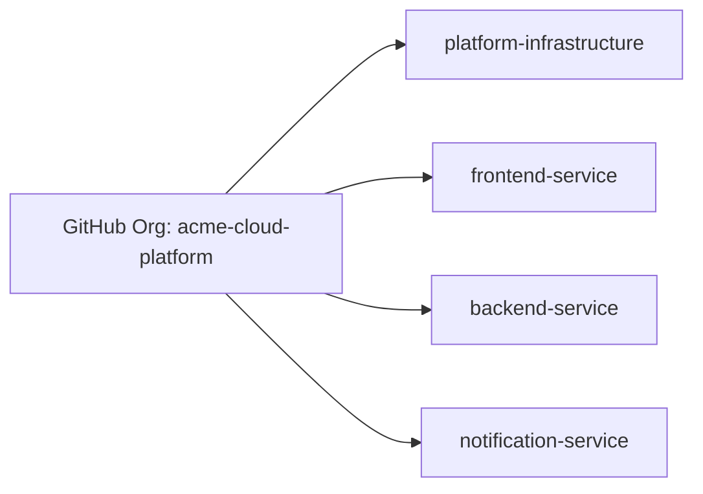

### Phase 2 — VPC / Networking

**What exists:**
| Resource | Value |
|---|---|
| VPC | `vpc-0d0f8e9094111d711` (`10.0.0.0/16`) |
| Public subnets | `10.0.0.0/24` (us-east-1a), `10.0.1.0/24` (us-east-1b) |
| Private subnets | `10.0.10.0/24` (us-east-1a), `10.0.11.0/24` (us-east-1b) |
| Internet Gateway | `acme-cloud-poc-igw` |
| NAT Gateway | `acme-cloud-poc-nat` (single NAT, in public subnet) |
| Route tables | `acme-cloud-poc-public-rt`, `acme-cloud-poc-private-rt` |

**How it connects:**
- Public subnets route `0.0.0.0/0` → **Internet Gateway** directly (inbound/outbound internet)
- Private subnets route `0.0.0.0/0` → **NAT Gateway** (outbound only — private subnet resources can reach the internet to pull images/updates, but nothing from the internet can initiate a connection to them)
- Public subnets are tagged `kubernetes.io/role/elb = 1` — tells the AWS Load Balancer Controller (Phase 6) "put internet-facing ALBs here"
- Private subnets are tagged `kubernetes.io/role/internal-elb = 1` — tells it "put internal ALBs here" and this is also where EKS nodes + RDS live

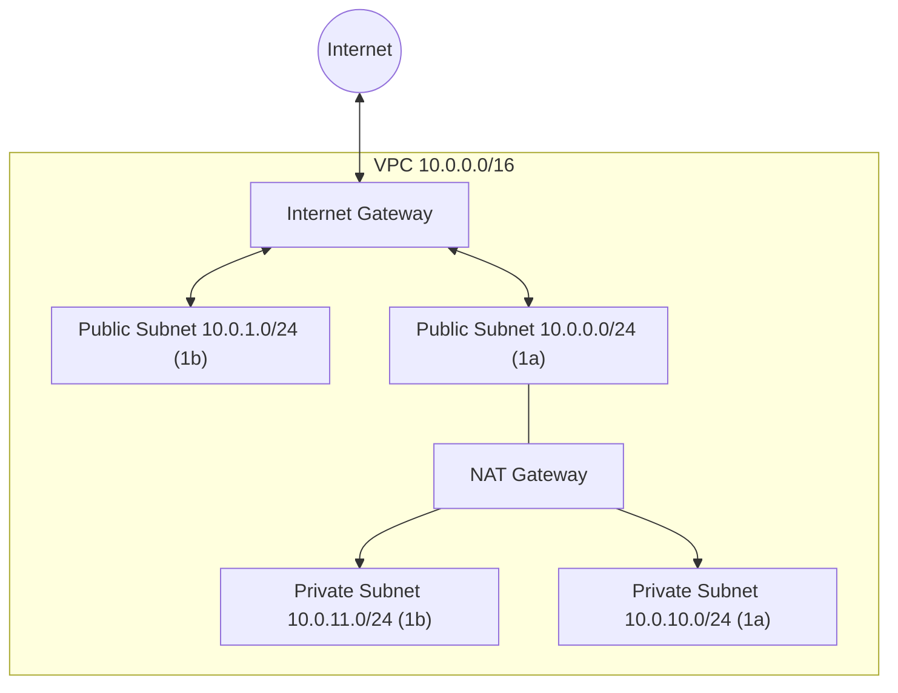

#### Running in all three environments

Since Phase 10, this module is invoked three times — once per environment folder in `live/` — each with its own CIDR block, fully isolated.

Click an environment below to see its actual values:

<details>
<summary><b>POC</b> — <code>live/poc/vpc/</code></summary>


</details>

<details>
<summary><b>DEV</b> — <code>live/dev/vpc/</code></summary>

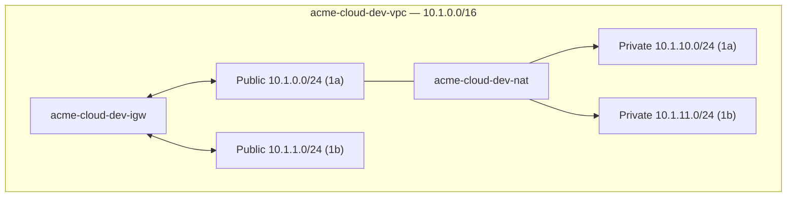
</details>

<details>
<summary><b>QA</b> — <code>live/qa/vpc/</code></summary>

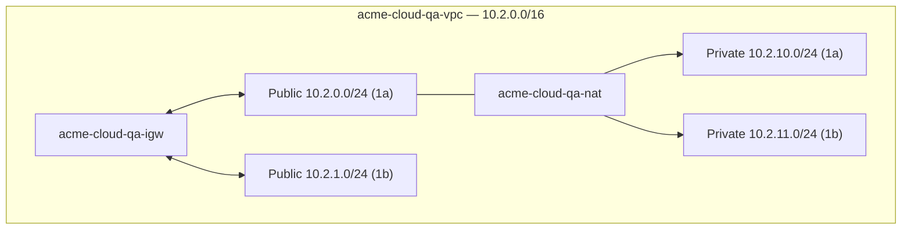
</details>

Same `modules/vpc/main.tf`, three separate VPCs, zero overlapping IP ranges — non-overlapping CIDRs chosen deliberately in case peering/Transit Gateway is ever needed between environments later.

### Phase 3 — EKS Cluster + Node Group

**What exists:**
| Resource | Value |
|---|---|
| Cluster | `acme-cloud-poc-eks` |
| Cluster endpoint | `https://1CE30413C41DA517ADB1C61C126172E5.gr7.us-east-1.eks.amazonaws.com` |
| Cluster security group | `sg-02080e5747d7198f9` |
| Cluster IAM role | `acme-cloud-poc-eks-cluster-role` (trusts `eks.amazonaws.com`) |
| Node IAM role | `acme-cloud-poc-eks-node-role` — `arn:aws:iam::338449997393:role/acme-cloud-poc-eks-node-role` (trusts `ec2.amazonaws.com`) |
| Node group | `acme-cloud-poc-nodes` — 3× `t3.micro`, private subnets only, `--max-pods=110` per node, `desired=3, min=1, max=4` |
| Auth mode | `API_AND_CONFIG_MAP` (needed for Phase 5's access entries) |
| Launch template | `acme-cloud-poc-nodes-*` — custom AL2023 `nodeadm` bootstrap, overrides max-pods |
| VPC CNI addon | `ENABLE_PREFIX_DELEGATION=true`, `WARM_PREFIX_TARGET=1` |

**How it connects:**
- Cluster control plane ENIs sit across **all 4 subnets** (public + private) from Phase 2
- Worker nodes (the actual EC2 instances) sit **only in private subnets** — no public IP, no direct internet exposure, all outbound traffic goes through the NAT Gateway
- `acme-cloud-poc-eks-node-role` has 3 AWS-managed policies attached: `AmazonEKSWorkerNodePolicy` (talk to control plane), `AmazonEC2ContainerRegistryReadOnly` (pull images from ECR — connects to Phase 4), `AmazonEKS_CNI_Policy` (pod networking)
- `acme-cloud-poc-eks-cluster-role` has `AmazonEKSClusterPolicy` attached — lets AWS manage the control plane on your behalf
- The managed node group's underlying Auto Scaling Group is auto-tagged by EKS with `k8s.io/cluster-autoscaler/enabled=true` and `k8s.io/cluster-autoscaler/acme-cloud-poc-eks=owned` — this is what lets **Cluster Autoscaler (Phase 11)** discover and manage it with zero extra tagging config needed in this module

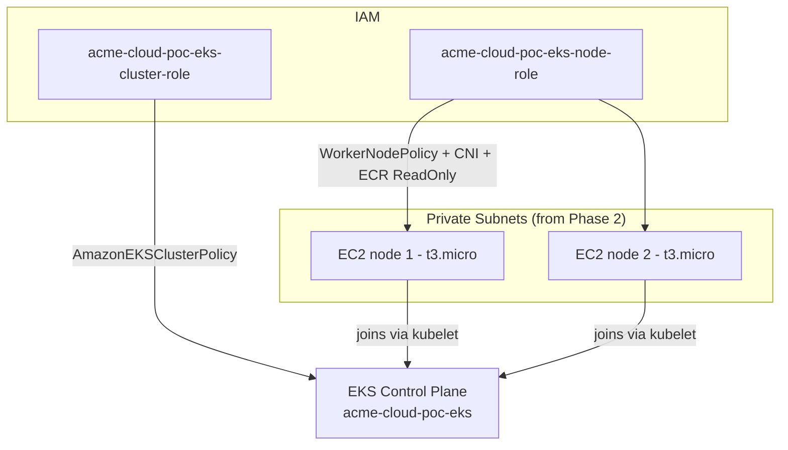

#### Pod density configuration

Every node runs with VPC CNI Prefix Delegation enabled (`ENABLE_PREFIX_DELEGATION=true`, `WARM_PREFIX_TARGET=1`) and an explicit `--max-pods=110` set via a custom launch template (AL2023 `nodeadm` bootstrap) — this is standard EKS best practice regardless of instance size, and what allows `t3.micro` nodes to host a realistic number of pods. Full rationale and the issue this originally solved are in `Debug.md`.

#### Running in all three environments

Same `modules/eks/` module, three separate clusters — each with its own control plane, its own node group, its own dedicated worker nodes. `dev`/`qa` run fewer nodes since they're lower-traffic, non-production environments; the max-pods/prefix-delegation fix above applies identically to all three, since it lives in the module, not per-environment config.

<details>
<summary><b>POC</b> — <code>live/poc/eks/</code></summary>

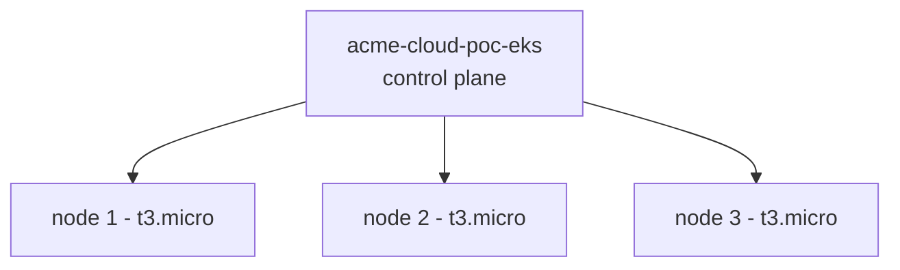
desired=3, min=1, max=4
</details>

<details>
<summary><b>DEV</b> — <code>live/dev/eks/</code></summary>

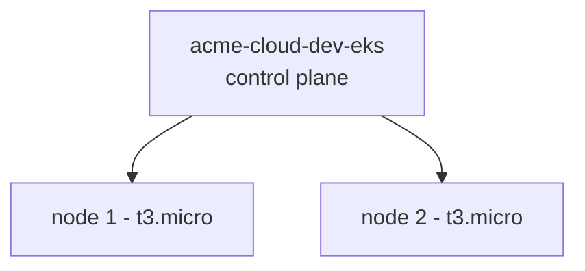
desired=2, min=1, max=3
</details>

<details>
<summary><b>QA</b> — <code>live/qa/eks/</code></summary>

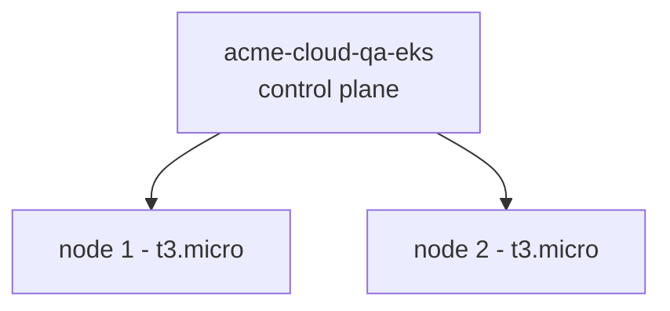
desired=2, min=1, max=3
</details>

### Phase 4 — ECR Repos + RDS

**What exists — ECR:**
| Repo | URL |
|---|---|
| frontend | `338449997393.dkr.ecr.us-east-1.amazonaws.com/acme-cloud-poc-frontend` |
| backend | `338449997393.dkr.ecr.us-east-1.amazonaws.com/acme-cloud-poc-backend` |
| notification | `338449997393.dkr.ecr.us-east-1.amazonaws.com/acme-cloud-poc-notification` |

**What exists — RDS:**
| Resource | Value |
|---|---|
| DB instance | `acme-cloud-poc-db` (Postgres 16.4, `db.t3.micro`) |
| Endpoint | `acme-cloud-poc-db.c8vqsikioi3n.us-east-1.rds.amazonaws.com` |
| Subnet group | private subnets only (from Phase 2) |
| Security group | `sg-0cc373dbdf0493486` |
| Secrets Manager secret | `arn:aws:secretsmanager:us-east-1:338449997393:secret:acme-cloud-poc-rds-credentials-GLxxD4` |
| Publicly accessible | `false` |
| Secret recovery window | `0` days (force-delete on destroy, not the default 30) |

**How it connects:**
- RDS security group `sg-0cc373dbdf0493486` allows inbound **only** from the **EKS cluster security group** (`sg-02080e5747d7198f9`, from Phase 3) on port 5432 — nothing else in the account, and nothing on the internet, can reach the database
- DB credentials (username, password, host, port) are stored as JSON in Secrets Manager — this secret ARN is what **External Secrets Operator** (Phase 7) syncs into a Kubernetes Secret
- ECR repos have zero network dependency — they're pulled into the picture only when the node IAM role (`acme-cloud-poc-eks-node-role`, Phase 3) uses its `AmazonEC2ContainerRegistryReadOnly` permission to pull images at pod-start time
- The `acme-cloud-poc-notification` ECR repo, created here in Phase 4, sat unused until Phase 10 — proof that ECR repos for all 3 services were provisioned upfront, once, and never needed to change

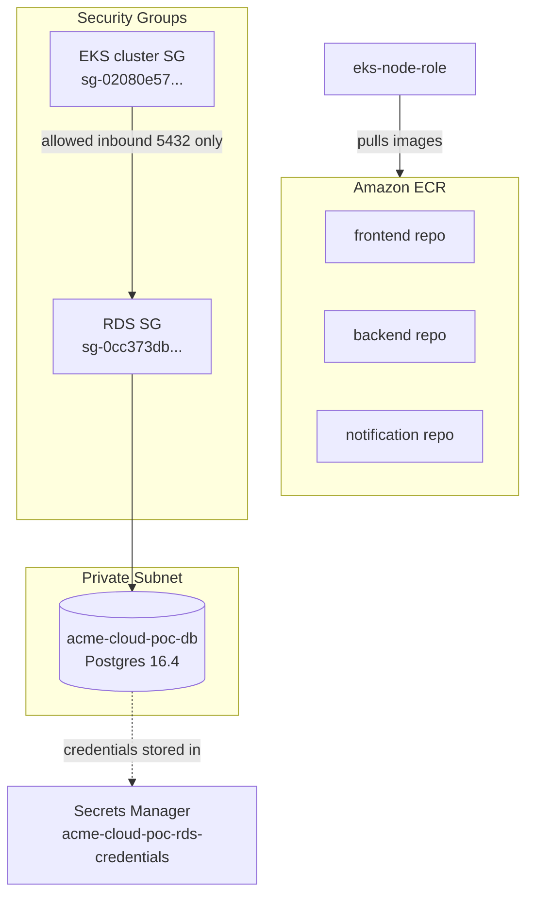

#### Running in all three environments

ECR repos and RDS instances are **not shared** across environments — each environment gets its own 3 ECR repos and its own Postgres instance, so a `dev` image push never touches `poc`'s registry, and a `qa` database is empty/independent from `poc`'s real data.

<details>
<summary><b>POC</b> — <code>live/poc/ecr/</code> + <code>live/poc/rds/</code></summary>

```
ECR: acme-cloud-poc-frontend, acme-cloud-poc-backend, acme-cloud-poc-notification
RDS: acme-cloud-poc-db (db.t3.micro)
```
</details>

<details>
<summary><b>DEV</b> — <code>live/dev/ecr/</code> + <code>live/dev/rds/</code></summary>

```
ECR: acme-cloud-dev-frontend, acme-cloud-dev-backend, acme-cloud-dev-notification
RDS: acme-cloud-dev-db (db.t3.micro)
```
</details>

<details>
<summary><b>QA</b> — <code>live/qa/ecr/</code> + <code>live/qa/rds/</code></summary>

```
ECR: acme-cloud-qa-frontend, acme-cloud-qa-backend, acme-cloud-qa-notification
RDS: acme-cloud-qa-db (db.t3.micro)
```
</details>

### Phase 5 — IAM OIDC Provider for GitHub Actions

**What exists:**
| Resource | Value |
|---|---|
| OIDC provider | `arn:aws:iam::338449997393:oidc-provider/token.actions.githubusercontent.com` |
| Deploy role | `acme-cloud-poc-github-deploy-role` — `arn:aws:iam::338449997393:role/acme-cloud-poc-github-deploy-role` |
| Trusted repos | `frontend-service`, `backend-service`, `notification-service`, `platform-infrastructure` (org: `acme-cloud-platform`) |
| EKS access entry | maps the deploy role to `AmazonEKSEditPolicy` (cluster-scoped) |

**How it connects — the full trust chain:**

1. A GitHub Actions workflow runs in, say, `backend-service`
2. GitHub mints a short-lived OIDC token, signed, claiming `repo:acme-cloud-platform/backend-service:*`
3. The workflow calls AWS STS `AssumeRoleWithWebIdentity`, presenting that token
4. AWS checks: does this token's issuer match `oidc-provider/token.actions.githubusercontent.com`? ✅ (the OIDC provider resource)
5. AWS checks: does the `sub` claim in the token match one of the `StringLike` conditions on `acme-cloud-poc-github-deploy-role`'s trust policy? ✅ (repo is in the allowed list — `notification-service` was listed here from day one, in Phase 5, long before it existed as a real deployed service)
6. AWS issues **temporary credentials**, scoped to this role, valid only for the workflow run's duration — no static key was ever stored anywhere
7. Those temporary credentials carry two attached inline policies: `ecr-push` (can push images to any of the 3 ECR repos from Phase 4) and `eks-describe` (can call `DescribeCluster`, needed for `aws eks update-kubeconfig`)
8. Separately, the **EKS Access Entry** maps this same role ARN to `AmazonEKSEditPolicy` inside the cluster's own RBAC — this is what actually lets `kubectl apply` succeed once authenticated, since IAM permissions alone don't grant Kubernetes-level permissions

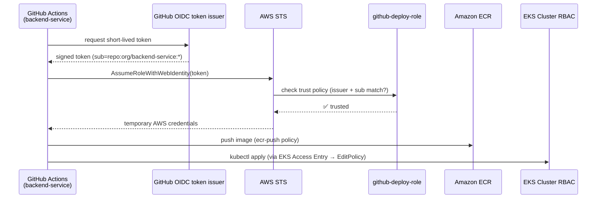

#### Running in all three environments

The GitHub OIDC **provider** itself is account-wide — AWS only allows one OIDC provider per issuer URL, so it's created once and every environment's deploy role trusts the same provider. What differs per environment is the **deploy role** and its EKS Access Entry, each pointing at that environment's own cluster:

<details>
<summary><b>POC</b> — <code>live/poc/iam-oidc/</code></summary>

```
Role: acme-cloud-poc-github-deploy-role
Access Entry → acme-cloud-poc-eks (AmazonEKSEditPolicy)
```
</details>

<details>
<summary><b>DEV</b> — <code>live/dev/iam-oidc/</code></summary>

```
Role: acme-cloud-dev-github-deploy-role
Access Entry → acme-cloud-dev-eks (AmazonEKSEditPolicy)
```
</details>

<details>
<summary><b>QA</b> — <code>live/qa/iam-oidc/</code></summary>

```
Role: acme-cloud-qa-github-deploy-role
Access Entry → acme-cloud-qa-eks (AmazonEKSEditPolicy)
```
</details>

A workflow pointed at the wrong environment's role simply can't reach the other environment's cluster — the Access Entry is the actual enforcement boundary, not just the IAM trust policy.

### Phase 6 — AWS Load Balancer Controller

**What exists:**
| Resource | Value |
|---|---|
| EKS OIDC provider (IRSA) | `arn:aws:iam::338449997393:oidc-provider/oidc.eks.us-east-1.amazonaws.com/id/1CE30413C41DA517ADB1C61C126172E5` |
| Controller IAM role | `acme-cloud-poc-alb-controller-role` — `arn:aws:iam::338449997393:role/acme-cloud-poc-alb-controller-role` |
| Controller IAM policy | official AWS-published policy — full ELB/EC2 permissions to create/manage ALBs, target groups, listeners, security groups |
| Kubernetes ServiceAccount | `aws-load-balancer-controller` in `kube-system`, annotated with the IAM role ARN |
| Helm release | `aws-load-balancer-controller` chart v1.8.1, 2 replicas, both `Running` |

**How it connects — a different kind of OIDC than Phase 5:**

Phase 5's OIDC lets something **outside** AWS (GitHub Actions) assume a role. Phase 6 uses a different mechanism called **IRSA** (IAM Roles for Service Accounts) — it lets a **pod running inside EKS** assume a role, using the cluster's own built-in OIDC issuer (`oidc.eks.us-east-1.amazonaws.com/id/...`), which is separate from GitHub's OIDC issuer.

The trust is entirely carried by one annotation on the Kubernetes ServiceAccount:
```
eks.amazonaws.com/role-arn: arn:aws:iam::338449997393:role/acme-cloud-poc-alb-controller-role
```
When the controller pod starts using that ServiceAccount, EKS automatically injects temporary AWS credentials scoped to that role — no secret, no key, ever stored in the cluster.

Once running, the controller watches the Kubernetes API for `Ingress` resources. When `backend-service`/`frontend-service` (Phase 8/9) create one, the controller reads the subnet tags from Phase 2 (`kubernetes.io/role/elb` for public, `kubernetes.io/role/internal-elb` for private) to decide where to place the ALB, then calls the AWS ELB API directly using its IRSA credentials to actually create it.

This module also creates the **EKS cluster's own OIDC provider resource** itself (`aws_iam_openid_connect_provider.eks`) — since an AWS account only gets one such provider per issuer URL, every later module needing IRSA (Cluster Autoscaler and EBS CSI driver, both in Phase 11; External Secrets in Phase 7) reads this same provider's ARN as a dependency instead of creating their own.

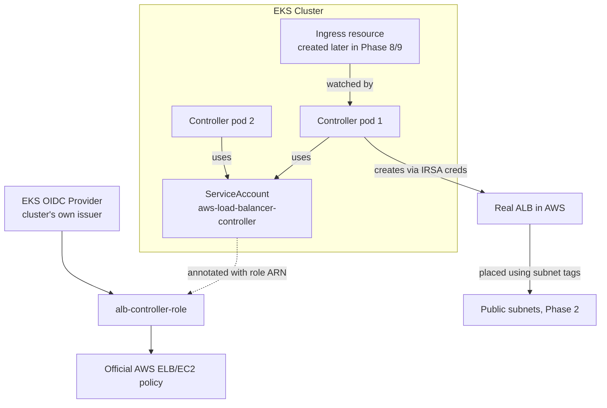

#### Running in all three environments

Unlike the GitHub OIDC provider (Phase 5, account-wide), **each cluster has its own EKS OIDC provider** — IRSA is cluster-scoped by design. So `poc`, `dev`, and `qa` each run their own AWS Load Balancer Controller, with its own IRSA role, watching only its own cluster's Ingress resources.

<details>
<summary><b>POC</b> — <code>live/poc/alb-controller/</code></summary>

```
Role: acme-cloud-poc-alb-controller-role
IRSA via: acme-cloud-poc-eks's own OIDC provider
Controls ALBs in: acme-cloud-poc-vpc only
```
</details>

<details>
<summary><b>DEV</b> — <code>live/dev/alb-controller/</code></summary>

```
Role: acme-cloud-dev-alb-controller-role
IRSA via: acme-cloud-dev-eks's own OIDC provider
Controls ALBs in: acme-cloud-dev-vpc only
```
</details>

<details>
<summary><b>QA</b> — <code>live/qa/alb-controller/</code></summary>

```
Role: acme-cloud-qa-alb-controller-role
IRSA via: acme-cloud-qa-eks's own OIDC provider
Controls ALBs in: acme-cloud-qa-vpc only
```
</details>

### Phase 7 — External Secrets Operator + Secrets Manager Wiring

**What exists:**
| Resource | Value |
|---|---|
| ESO IAM role | `acme-cloud-poc-external-secrets-role` — `arn:aws:iam::338449997393:role/acme-cloud-poc-external-secrets-role` |
| ESO namespace | `external-secrets` |
| ClusterSecretStore | `aws-secretsmanager` — `Ready: True` |
| ExternalSecret | `rds-credentials` (namespace `default`) — `Status: SecretSynced` |
| Synced K8s Secret | `rds-credentials` — 5 keys: username, password, dbname, host, port |

**How it connects:**
- Reuses the **same EKS OIDC provider** from Phase 6 (an AWS account only gets one OIDC provider per issuer URL) — read via remote state instead of recreated
- ESO's IAM role is scoped tightly: read-only, and only on the **one specific RDS secret ARN** from Phase 4, nothing else in Secrets Manager
- Used `ClusterSecretStore` instead of namespaced `SecretStore` — the ESO ServiceAccount lives in the `external-secrets` namespace, but the synced Secret needs to land in `default` (where `backend-service` will run); namespaced `SecretStore` only allows same-namespace ServiceAccount references, `ClusterSecretStore` doesn't have that restriction
- The `ExternalSecret` re-syncs hourly — if the RDS password ever rotates in Secrets Manager, the K8s Secret updates automatically, no redeploy needed
- `backend-service` (Phase 8) mounts the `rds-credentials` K8s Secret directly as an env var — it never talks to Secrets Manager or AWS APIs itself. **By Phase 10, this same Secret is consumed by 2 services** (`backend-service` and `notification-service`), with zero changes made here to support the second consumer

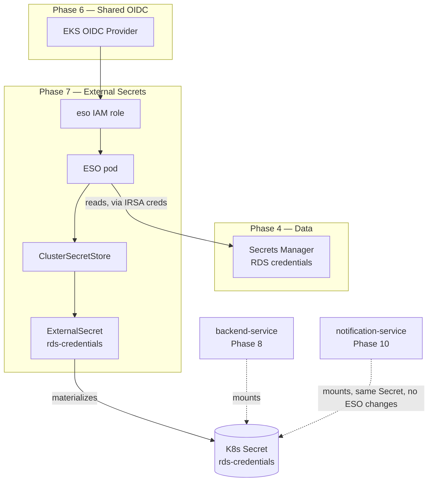

#### Running in all three environments

Each environment's ESO reads from **its own environment's RDS secret** (Phase 4) — `dev`'s ESO can never sync `poc`'s database credentials, since the IAM role scoping and the secret ARN are both environment-specific.

<details>
<summary><b>POC</b> — <code>live/poc/external-secrets/</code></summary>

```
ESO role: acme-cloud-poc-external-secrets-role
Reads secret: acme-cloud-poc-rds-credentials only
Syncs into: acme-cloud-poc-eks's default namespace
```
</details>

<details>
<summary><b>DEV</b> — <code>live/dev/external-secrets/</code></summary>

```
ESO role: acme-cloud-dev-external-secrets-role
Reads secret: acme-cloud-dev-rds-credentials only
Syncs into: acme-cloud-dev-eks's default namespace
```
</details>

<details>
<summary><b>QA</b> — <code>live/qa/external-secrets/</code></summary>

```
ESO role: acme-cloud-qa-external-secrets-role
Reads secret: acme-cloud-qa-rds-credentials only
Syncs into: acme-cloud-qa-eks's default namespace
```
</details>

**This is the last infrastructure phase (2-7) that varies per environment.** Phases 8-10 below are application deployments — the same app code runs in whichever environment's cluster you point `kubectl`/CI at (via that environment's `kubeconfig` and deploy role from Phase 5); the app manifests themselves don't change per environment.

### Phase 8 — backend-service (first application repo, deployed)

**What exists:**
| Resource | Value |
|---|---|
| Repo | `backend-service` (FastAPI, separate repo from `platform-infrastructure`) |
| Docker image | multi-stage build — `python:3.11-slim` builder → `gcr.io/distroless/python3-debian12:nonroot` runtime |
| Deployment | 2 replicas, resource requests/limits sized for `t3.micro` nodes |
| Service | ClusterIP, internal only |
| Ingress | triggers Phase 6's ALB Controller — real ALB provisioned automatically |
| Endpoints | `GET /api/healthz`, `GET /api/readyz` (real RDS check), `POST /api/order`, `GET /api/orders` |

**How it connects — first real end-to-end proof of every prior phase:**

- **CI/CD auth (Phase 5)**: workflow assumes `acme-cloud-poc-github-deploy-role` via OIDC — zero static AWS keys in this repo either
- **Image registry (Phase 4)**: built image pushed to `acme-cloud-poc-backend` ECR repo, tagged with the commit SHA
- **Cluster deploy (Phase 3 + 5)**: `kubectl apply` succeeds because of the EKS Access Entry mapping the same OIDC role to `AmazonEKSEditPolicy`
- **DB credentials (Phase 7)**: the Deployment's env vars pull from the `rds-credentials` K8s Secret via `secretKeyRef` — the app never touches Secrets Manager or AWS credentials directly
- **Ingress → ALB (Phase 6)**: creating the `Ingress` resource is what triggers AWS Load Balancer Controller to actually provision a real, internet-facing ALB — this was the first real-world test of that controller since it went live in Phase 6
- **Network path**: `Internet → ALB (public subnet) → target group → pod (private subnet) → RDS (private subnet, SG-restricted to EKS nodes)`

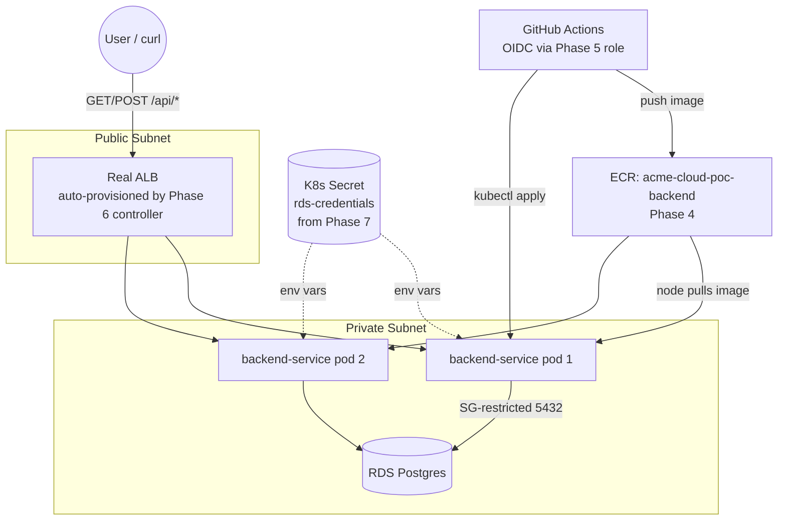

### Phase 9 — frontend-service (second application repo, full stack proven live)

**What exists:**
| Resource | Value |
|---|---|
| Repo | `frontend-service` (React + Vite, separate repo) |
| Docker image | multi-stage — `node:20-slim` builder → `gcr.io/distroless/nodejs20-debian12:nonroot` runtime |
| Static server | `server.js` — ~40-line zero-dependency Node HTTP server (no nginx; distroless has no official nginx equivalent) |
| Deployment | 2 replicas, serves on port 8080 |
| Ingress | path `/`, **merged into backend's ALB** via `IngressGroup` (`group.name: acme-cloud-poc`) instead of provisioning a second ALB |

**How it connects — the whole platform, proven together for the first time:**

- **One shared ALB, not two**: both `frontend-service` and `backend-service` Ingress resources use the same `group.name`, so AWS Load Balancer Controller (Phase 6) merges them into a single ALB with combined routing rules. `group.order` controls priority — backend's `/api` (order 1) is evaluated before frontend's catch-all `/` (order 10), so `/api` requests don't get swallowed by the frontend's broader rule.
- **Same-origin API calls, zero CORS config**: because both services sit behind the same ALB/domain, the React app calls `/api/*` as a relative path — no cross-origin request, no CORS headers to manage on the backend.
- **Same OIDC role, same CI/CD pattern**: `frontend-service`'s workflow reuses the exact same `acme-cloud-poc-github-deploy-role` from Phase 5 — its trust policy already listed this repo from the start.
- **First genuine end-to-end user-facing proof**: a browser hitting the ALB now renders a real React UI, submits an order through `/api/order`, and the order list re-fetches from `/api/orders` — the full path `browser → ALB → frontend pod` and `browser → ALB → backend pod → RDS` both work simultaneously, confirmed live.

**Note on ALB address**: the ALB backing this shared IngressGroup was recreated after this phase (during Phase 10 verification) — current address is `k8s-acmecloudpoc-0f83fcb8f7-780986312.us-east-1.elb.amazonaws.com`, see the Quick-reference table at the end of this file for the current value.

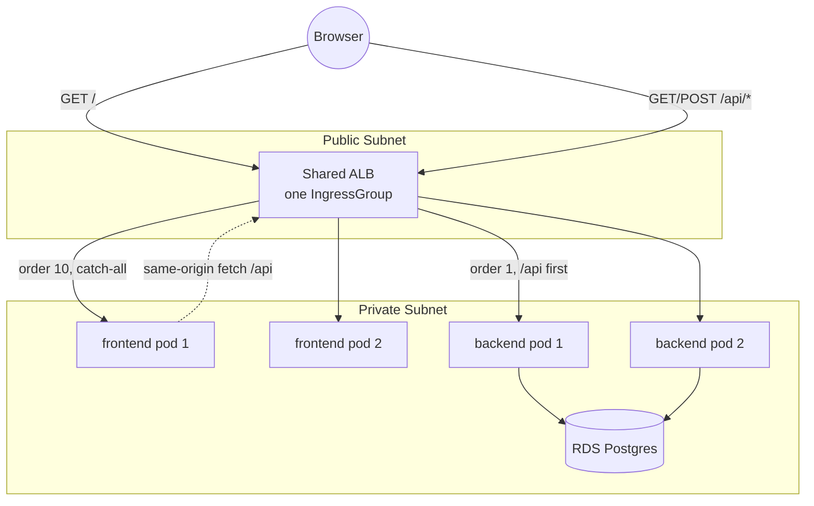

### Phase 10 — notification-service (third application repo — proves the "zero infra changes" claim)

**What exists:**
| Resource | Value |
|---|---|
| Repo | `notification-service` (Python background worker, separate repo) |
| Docker image | multi-stage — `python:3.11-slim` builder → `gcr.io/distroless/python3-debian12:nonroot` runtime |
| Workload type | background polling worker — **no web server, no exposed port** |
| Deployment | 1 replica (deliberate — see "Why only 1 replica" below) |
| Service / Ingress | **none** — this pod only reaches out to RDS, nothing needs to reach in |
| Poll interval | 15 seconds (`POLL_INTERVAL_SECONDS` env var) |
| State tracking | `notification_state` table in the same Postgres DB — tracks `last_notified_order_id` so restarts don't resend old notifications |
| Deploy method | same automated pipeline as Phases 8/9 — push to `main`, workflow handles OIDC auth, build/push to ECR, `kubectl apply` |

**How it connects — the whole point of this phase:**

This is the deliberate proof of the platform's core design claim from `README.md`'s intro: *"Adding a new microservice never requires changing this repo."* Phase 10 adds a third, functionally different service (a worker, not a web app) and touches **zero files in `platform-infrastructure`**:

- **CI/CD trust (Phase 5)**: `acme-cloud-poc-github-deploy-role`'s trust policy already listed `notification-service` as an allowed repo from the very first `terraform apply` in Phase 5 — long before this repo had a single line of code. No IAM change needed to onboard it.
- **Image registry (Phase 4)**: the `acme-cloud-poc-notification` ECR repo was created in Phase 4, alongside frontend/backend, and sat empty until this phase pushed its first image.
- **Secrets (Phase 7)**: reuses the exact same `rds-credentials` K8s Secret that `backend-service` already mounts — same 5 keys (`host`, `port`, `dbname`, `username`, `password`), same `secretKeyRef` pattern. External Secrets Operator needed zero new configuration to support a second consumer.
- **Network (Phase 2 + 3)**: runs on the same private-subnet worker nodes as every other pod — no new subnet, no new security group, no new route.
- **Database (Phase 4)**: connects to the same RDS instance `backend-service` writes to, reading the `orders` table `backend-service` created, and creating its own small `notification_state` tracking table alongside it — same database, no new RDS instance.

**How the worker actually operates:**
1. Polls `orders` in a loop, every 15 seconds, for any `id` greater than the last one it already processed
2. For each new order found, logs a "notification sent" line (the POC's stand-in for a real notification channel like SES/SNS) and advances `last_notified_order_id`
3. On any DB error mid-cycle, closes and reopens the connection, then retries next cycle — doesn't crash the pod on a transient DB hiccup

**Why only 1 replica**: the "have I already notified on this order" check is a single shared counter row in Postgres, not a distributed lock. Two replicas polling simultaneously could both read the same "new" orders before either writes back the updated counter, causing duplicate notifications. A real production version of this would replace polling + a shared counter with a proper queue (SQS, with visibility timeouts) — which is safe to scale to many workers by design. For this POC, 1 replica is the correct, deliberate choice, not a limitation to "fix" later.

**Deploy pipeline**: `notification-service/.github/workflows/deploy.yml` follows the exact same OIDC-auth → build → push → deploy pattern as `backend-service` and `frontend-service` — push to `main`, the workflow assumes `acme-cloud-poc-github-deploy-role` via OIDC, builds and pushes the image to `acme-cloud-poc-notification`, substitutes it into `k8s/deployment.yaml`, and runs `kubectl apply` + waits for rollout. No manual steps.

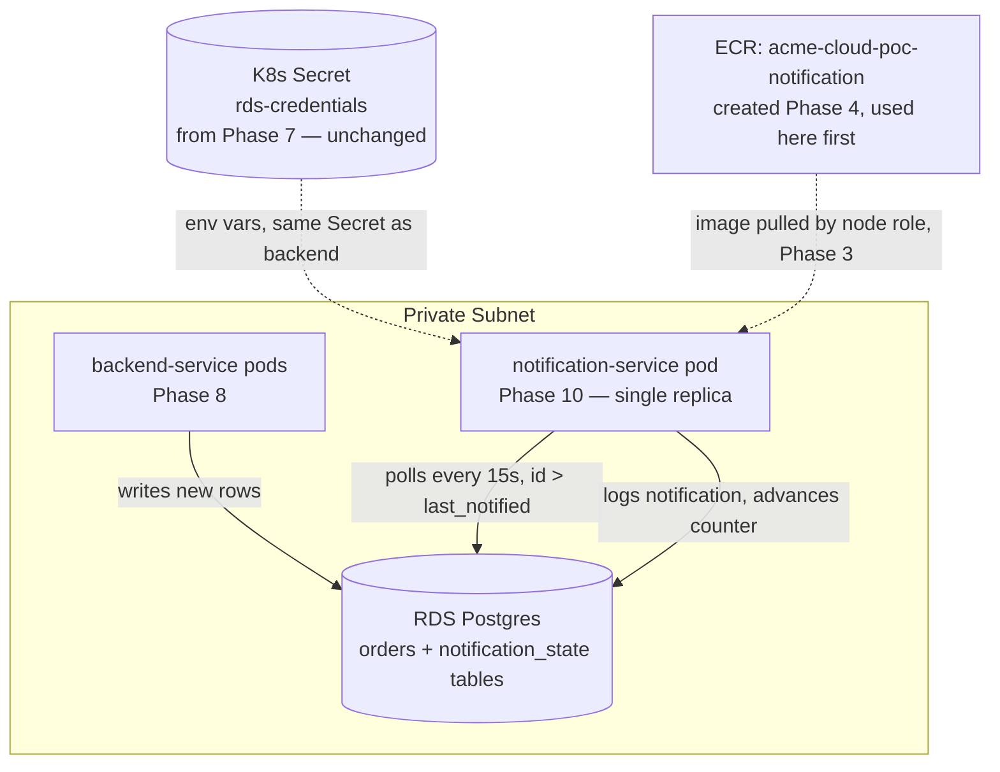

### Phase 11 — Cluster Autoscaler + EBS CSI Driver + Prometheus/Grafana (verified under load)

**What exists — Cluster Autoscaler:**
| Resource | Value |
|---|---|
| IAM role | `acme-cloud-poc-cluster-autoscaler-role` (IRSA, trusts the EKS OIDC provider from Phase 6) |
| Helm release | `cluster-autoscaler` chart `9.46.6`, image tag `v1.30.0`, namespace `kube-system` |
| Discovery method | `autoDiscovery.clusterName=acme-cloud-poc-eks` — no ASG name hardcoded anywhere |
| Node group bounds | `min=1, max=4` (set on the ASG in Phase 3) |

**What exists — EBS CSI Driver:**
| Resource | Value |
|---|---|
| IAM role | `acme-cloud-poc-ebs-csi-role` (IRSA, `AmazonEBSCSIDriverPolicy`) |
| Install method | first-party EKS addon (`aws_eks_addon`, not Helm) — auto-patched by AWS for cluster version compatibility |
| StorageClass | `gp3`, provisioner `ebs.csi.aws.com`, marked cluster-default |

**What exists — Monitoring:**
| Resource | Value |
|---|---|
| Namespace | `monitoring` |
| Prometheus | `prometheus` chart `25.24.1` — server + node-exporter + kube-state-metrics |
| Grafana | `grafana` chart `8.4.2`, admin password via `sensitive` Terraform variable (never hardcoded) |
| Storage | Prometheus server PVC, backed by the `gp3` StorageClass above |
| Dashboard used for verification | Grafana community dashboard **1860** ("Node Exporter Full") |

**How it connects:**

- **Cluster Autoscaler and EBS CSI both reuse the same EKS OIDC provider from Phase 6** — same IRSA pattern as External Secrets (Phase 7) and ALB Controller (Phase 6) itself: one provider per cluster, referenced by every module that needs a pod to assume an AWS role, never recreated.
- **Cluster Autoscaler needs zero manual ASG tagging.** EKS managed node groups (Phase 3) auto-tag their underlying Auto Scaling Group with `k8s.io/cluster-autoscaler/enabled=true` and `k8s.io/cluster-autoscaler/<cluster-name>=owned`. Cluster Autoscaler's `autoDiscovery.clusterName` setting finds that ASG using exactly those tags, with no ASG name or ARN hardcoded in Terraform.
- **EBS CSI is applied before Monitoring** — Monitoring's Prometheus PVC binds against the `gp3` StorageClass that EBS CSI installs, so EBS CSI is a dependency of Monitoring, not the other way around.
- **Grafana connects to Prometheus manually through the UI**, then imports community dashboard `1860` on top — kept manual deliberately for the POC rather than adding more Terraform-managed Grafana resources.
- **Destroy order is the reverse of deploy order**, enforced in `down-poc.sh` — see the block below.

**Verified live under load:** Grafana dashboard `1860` showed live CPU/memory/disk/network for all 3 nodes; `backend-service` was scaled 2 → 150 → 2 replicas via `kubectl scale`, which drove Cluster Autoscaler through a real scale-up (node count 3 → 4) and, after its cooldown window, a scale-down back to 3 — watched live via `kubectl get nodes -w`. See `Debug.md` for anything that broke along the way and how it was fixed.

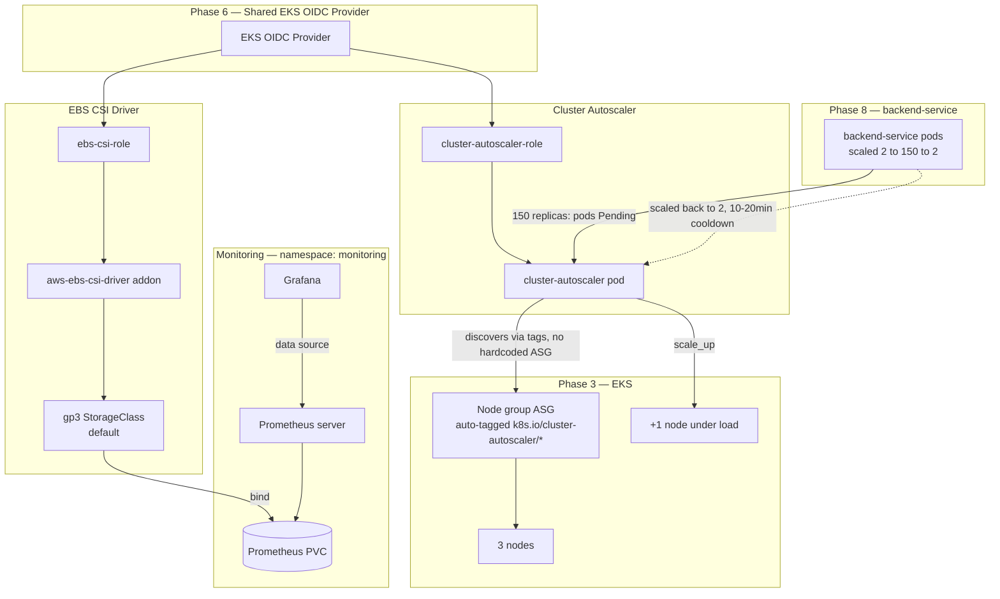

#### Running in all three environments

Same pattern as every prior phase-11-and-earlier module: same Terraform code, environment-specific inputs. `dev` and `qa` are not yet applied for Phase 11 — only `poc` has been built and verified so far, using the exact deploy order below. Extending to `dev`/`qa` is just 3 new `terragrunt.hcl` wrapper files per environment (`cluster-autoscaler`, `ebs-csi`, `monitoring`), same as every other phase.

<details>
<summary><b>POC</b> — <code>live/poc/cluster-autoscaler/</code> + <code>live/poc/ebs-csi/</code> + <code>live/poc/monitoring/</code> — RUNNING, VERIFIED</summary>

```
Cluster Autoscaler role: acme-cloud-poc-cluster-autoscaler-role
EBS CSI role:            acme-cloud-poc-ebs-csi-role
Node group bounds:       min=1, max=4
Monitoring namespace:    monitoring (Prometheus + Grafana, gp3-backed PVC)
```
</details>

<details>
<summary><b>DEV</b> — not yet applied</summary>

Same 3 modules, same deploy order, `environment = "dev"` — planned next.
</details>

<details>
<summary><b>QA</b> — not yet applied</summary>

Same 3 modules, same deploy order, `environment = "qa"` — planned next.
</details>

**Deploy/destroy order** (enforced in `up-poc.sh` / `down-poc.sh`, see `RUNBOOK.md` for the full command sequence):

```
up:   ... -> alb-controller -> cluster-autoscaler -> ebs-csi -> external-secrets -> monitoring
down: external-secrets -> monitoring -> cluster-autoscaler -> ebs-csi -> alb-controller -> ...
```

### Full picture — everything connected (Phases 1-11)

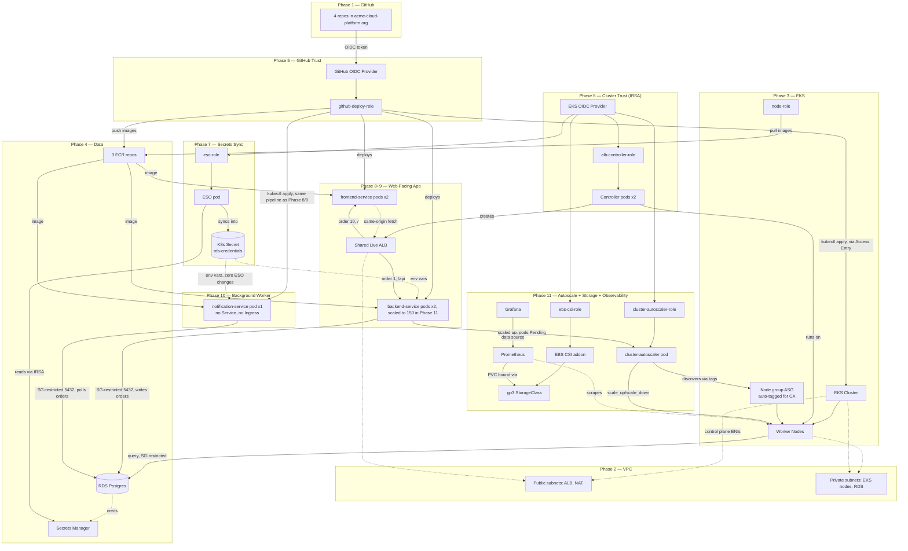

### Quick-reference: every ARN / ID we have so far

```
VPC ID:                    vpc-0d0f8e9094111d711
EKS cluster:                acme-cloud-poc-eks
EKS cluster SG:              sg-02080e5747d7198f9
EKS node role:                arn:aws:iam::338449997393:role/acme-cloud-poc-eks-node-role
EKS node group bounds:          min=1, desired=3, max=4
RDS endpoint:                     acme-cloud-poc-db.c8vqsikioi3n.us-east-1.rds.amazonaws.com
RDS security group:                 sg-0cc373dbdf0493486
RDS secret:                           arn:aws:secretsmanager:us-east-1:338449997393:secret:acme-cloud-poc-rds-credentials-GLxxD4
GitHub OIDC provider:                   arn:aws:iam::338449997393:oidc-provider/token.actions.githubusercontent.com
GitHub deploy role:                       arn:aws:iam::338449997393:role/acme-cloud-poc-github-deploy-role
EKS OIDC provider (IRSA):                   arn:aws:iam::338449997393:oidc-provider/oidc.eks.us-east-1.amazonaws.com/id/1CE30413C41DA517ADB1C61C126172E5
ALB controller role:                          arn:aws:iam::338449997393:role/acme-cloud-poc-alb-controller-role
External Secrets role:                          arn:aws:iam::338449997393:role/acme-cloud-poc-external-secrets-role
Cluster Autoscaler role:                          acme-cloud-poc-cluster-autoscaler-role
EBS CSI role:                                       acme-cloud-poc-ebs-csi-role
Default StorageClass:                                 gp3 (provisioner: ebs.csi.aws.com)
K8s Secret (synced):                                    rds-credentials (namespace: default)
Monitoring namespace:                                     monitoring (Prometheus + Grafana)
Shared live ALB (frontend + backend):                       k8s-acmecloudpoc-0f83fcb8f7-780986312.us-east-1.elb.amazonaws.com
ECR frontend:      338449997393.dkr.ecr.us-east-1.amazonaws.com/acme-cloud-poc-frontend
ECR backend:        338449997393.dkr.ecr.us-east-1.amazonaws.com/acme-cloud-poc-backend
ECR notification:     338449997393.dkr.ecr.us-east-1.amazonaws.com/acme-cloud-poc-notification
```

---

## Infrastructure structure: `modules/` + `live/` (Terragrunt, multi-environment)

- **`modules/`** — the actual resource logic (10 modules: `vpc`, `eks`, `ecr`, `rds`, `iam-oidc`, `alb-controller`, `external-secrets`, `cluster-autoscaler`, `ebs-csi`, `monitoring`). Every resource built across Phases 2-7 and 11 lives here, environment-agnostic — no hardcoded environment name, CIDR, or backend.
- **`live/`** — one tiny `terragrunt.hcl` wrapper per module per environment (~10-40 lines each): which module to use, and that environment's specific input values. `live/terragrunt.hcl` at the root is inherited by every wrapper below it — it auto-generates the S3 backend block and AWS provider block for every module, so neither is ever hand-written again. Modules pass outputs to each other via Terragrunt `dependency` blocks instead of the old `terraform_remote_state` data source.

**Three fully isolated environments exist — `poc`, `dev`, `qa`** — each with its own VPC, EKS cluster, RDS instance, and IAM roles. `poc` is the only one with Phase 11's autoscaler/storage/monitoring stack applied so far; `dev`/`qa` have Phases 2-7 running and are next in line for Phase 11. The one S3 bucket their state files live in (each environment gets its own state key inside that bucket — `poc/vpc/terraform.tfstate`, `dev/vpc/terraform.tfstate`, `qa/vpc/terraform.tfstate` — no collisions).

**Adding a new environment costs a handful of small `.hcl` files with different input values — zero duplicated Terraform code.** `diff live/poc/vpc/terragrunt.hcl live/dev/vpc/terragrunt.hcl` shows a ~3 line difference (CIDR + environment name); `modules/vpc/main.tf` — the actual 100+ lines of resource logic — was never touched or copied to create `dev` or `qa`.

### Full picture — all three environments, connected

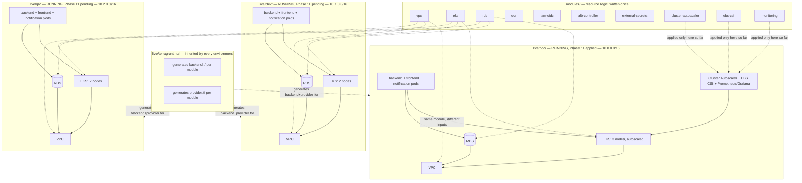

Same module code (top), three independently running stacks (bottom) — no traffic, no state, no resource ever crosses between `poc`, `dev`, and `qa`.

---

## Repo structure (this repo)

```
platform-infrastructure/
├── modules/                       ← resource logic, environment-agnostic
│   ├── vpc/
│   ├── eks/
│   ├── ecr/
│   ├── rds/
│   ├── iam-oidc/
│   ├── alb-controller/
│   ├── external-secrets/
│   ├── cluster-autoscaler/
│   ├── ebs-csi/
│   └── monitoring/
├── live/                          ← per-environment wrappers, no resource logic
│   ├── terragrunt.hcl             ← root config: generates backend + provider for everything below
│   ├── poc/                       ← applied, running, Phase 11 complete
│   │   ├── vpc/terragrunt.hcl
│   │   ├── eks/terragrunt.hcl
│   │   ├── ecr/terragrunt.hcl
│   │   ├── rds/terragrunt.hcl
│   │   ├── iam-oidc/terragrunt.hcl
│   │   ├── alb-controller/terragrunt.hcl
│   │   ├── external-secrets/terragrunt.hcl
│   │   ├── cluster-autoscaler/terragrunt.hcl
│   │   ├── ebs-csi/terragrunt.hcl
│   │   └── monitoring/terragrunt.hcl
│   ├── dev/                       ← running, Phase 11 pending
│   │   └── (same 7 Phase 2-7 module wrappers as poc, different inputs)
│   └── qa/                        ← running, Phase 11 pending
│       └── (same 7 Phase 2-7 module wrappers as poc, different inputs)
├── helm/
│   └── (base charts / shared values)
├── kubernetes/
│   └── (cluster-level configs, namespaces, RBAC)
├── .github/workflows/
│   └── reusable-deploy.yml
├── up-poc.sh / down-poc.sh        ← bring poc up/down, full dependency order + auto lock recovery
├── up-dev.sh / down-dev.sh
├── up-qa.sh / down-qa.sh
├── test1-monitoring.sh            ← verify Prometheus/Grafana are actually working
├── test2-cluster-autoscaler.sh    ← verify Cluster Autoscaler scales nodes up and down
├── POC.md
├── RUNBOOK.md
├── Must-Manual-setup.md
└── README.md
```

## Repo structure (each service repo — same pattern)

```
<service>-service/
├── src/ (or app/)
├── Dockerfile
├── helm-values.yaml
├── .github/workflows/deploy.yml   ← calls platform-infrastructure's reusable workflow
└── README.md
```

`notification-service` follows the same shape, minus the parts a background worker doesn't need:

```
notification-service/
├── app/
│   └── worker.py
├── Dockerfile
├── requirements.txt
├── k8s/
│   └── deployment.yaml            ← no service.yaml, no ingress.yaml — nothing external reaches this pod
├── .github/workflows/deploy.yml   ← same OIDC pipeline as backend/frontend-service
└── README.md
```